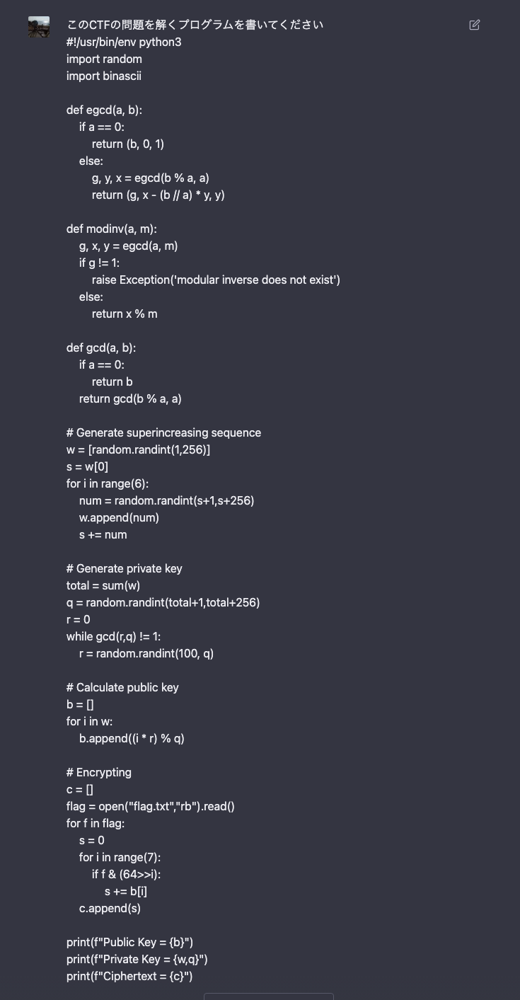
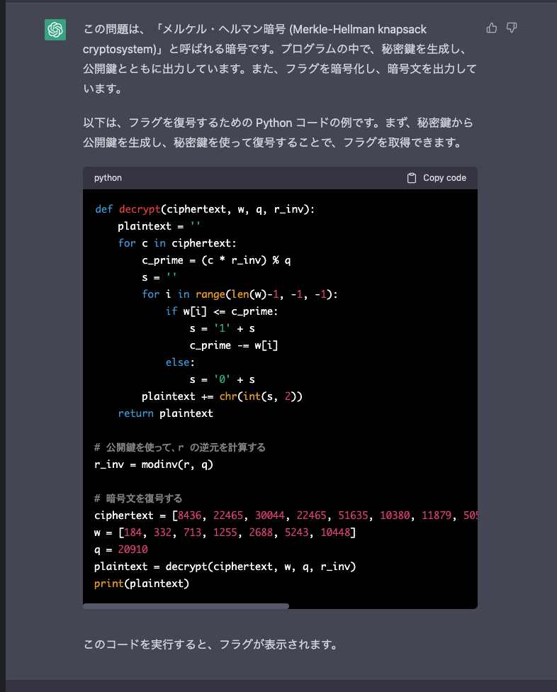
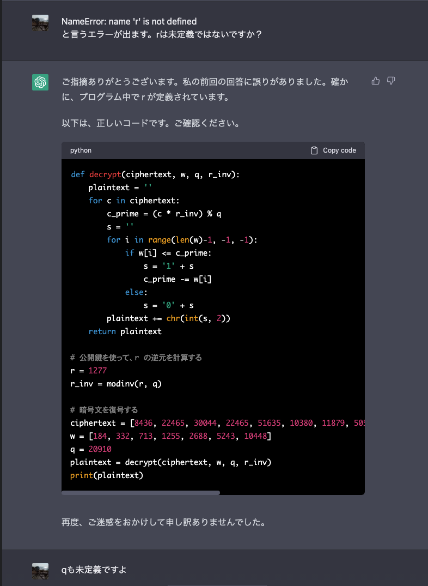
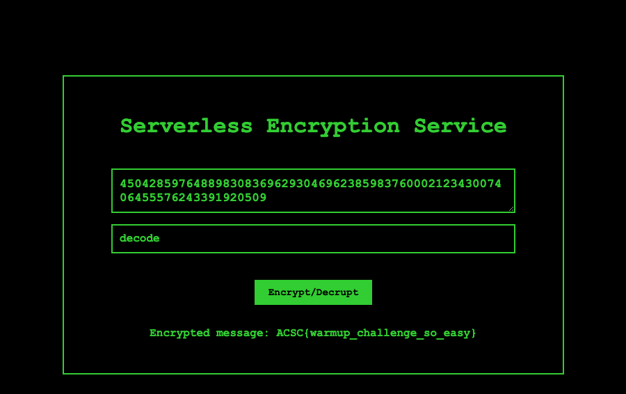

# ACSC 2023 Quals Challenges

## Merkle Hellman

```txt
tags: warmup, crypto
score: 50
authored: Stephen

We tired of RSA, try a new cryptosystem by merkle and hellman but we don’t know how to decrypt the ciphertext.

We need your help for decrypt the ciphertext to get back my flag.txt!
```

問題ファイルはこのようになっていました。

```py
#!/usr/bin/env python3
import random
import binascii

def egcd(a, b):
	if a == 0:
		return (b, 0, 1)
	else:
		g, y, x = egcd(b % a, a)
		return (g, x - (b // a) * y, y)

def modinv(a, m):
	g, x, y = egcd(a, m)
	if g != 1:
		raise Exception('modular inverse does not exist')
	else:
		return x % m

def gcd(a, b): 
	if a == 0: 
		return b 
	return gcd(b % a, a) 

# Generate superincreasing sequence
w = [random.randint(1,256)]
s = w[0]
for i in range(6):
	num = random.randint(s+1,s+256)
	w.append(num)
	s += num

# Generate private key
total = sum(w)
q = random.randint(total+1,total+256)
r = 0
while gcd(r,q) != 1:
	r = random.randint(100, q)

# Calculate public key
b = []
for i in w:
	b.append((i * r) % q)

# Encrypting
c = []
flag = open("flag.txt","rb").read()
for f in flag:
	s = 0
	for i in range(7):
		if f & (64>>i):
			s += b[i]
	c.append(s)

print(f"Public Key = {b}")
print(f"Private Key = {w,q}")
print(f"Ciphertext = {c}")

# Output:
# Public Key = [7352, 2356, 7579, 19235, 1944, 14029, 1084]
# Private Key = ([184, 332, 713, 1255, 2688, 5243, 10448], 20910)
# Ciphertext = [8436, 22465, 30044, 22465, 51635, 10380, 11879, 50551, 35250, 51223, 14931, 25048, 7352, 50551, 37606, 39550]
```

問題名からMerkle-Hellman暗号ということが推測でき、うまく解読すればフラグが手に入りますが、ここで閃きました。

**これ、ChatGPTで解けそうじゃね？？？？？**

聞きます。



> この問題は、「メルケル・ヘルマン暗号 (Merkle-Hellman knapsack cryptosystem)」と呼ばれる暗号です。

さすがやん！！！！！！！！！！



実行してみると少しプログラムがおかしいです。(※modinvとかはこっちでつけました)

```py
Traceback (most recent call last):
  File "/get_flag.py", line 31, in <module>
    r_inv = modinv(r, q)
NameError: name 'r' is not defined
```

再度聞きますが、この先はうまくやってくれませんでした(rは未定義って聞いたら`1277`とか言い出した、後から分かったことですが、`7313`が正解です)。



とはいえ、decrypt関数がなんかそれっぽいです。こいつを信じて、少し書き換えます。先ほどのプログラムで`q`は、最初に呼ばれるときは未定義でしたが後ろで定義されているので前に持っていきます。また`r`は全探索できそうなので、します。

少しだけ書き換えたプログラムが以下の通りです。

```py
from tqdm import tqdm


def egcd(a, b):
    if a == 0:
        return (b, 0, 1)
    else:
        g, y, x = egcd(b % a, a)
        return (g, x - (b // a) * y, y)


def modinv(a, m):
    g, x, y = egcd(a, m)
    if g != 1:
        raise Exception("modular inverse does not exist")
    else:
        return x % m


def gcd(a, b):
    if a == 0:
        return b
    return gcd(b % a, a)


def decrypt(ciphertext, w, q, r_inv):
    plaintext = ""
    for c in ciphertext:
        c_prime = (c * r_inv) % q
        s = ""
        for i in range(len(w) - 1, -1, -1):
            if w[i] <= c_prime:
                s = "1" + s
                c_prime -= w[i]
            else:
                s = "0" + s
        plaintext += chr(int(s, 2))
    return plaintext


# 公開鍵を使って、r の逆元を計算する
for r in tqdm(range(10000)):
    q = 20910
    if gcd(r, q) != 1:
        continue
    r_inv = modinv(r, q)

    # 暗号文を復号する
    ciphertext = [
        8436,
        22465,
        30044,
        22465,
        51635,
        10380,
        11879,
        50551,
        35250,
        51223,
        14931,
        25048,
        7352,
        50551,
        37606,
        39550,
    ]
    w = [184, 332, 713, 1255, 2688, 5243, 10448]
    plaintext = decrypt(ciphertext, w, q, r_inv)
    if "ACSC" in plaintext:
        print(plaintext)
```

するとフラグ`ACSC{E4zY_P3@zy}`が手に入りました。まったく頭を使わずに解けました✌️

## serverless

```txt
I made a serverless encryption service. It is so serverless that you should host it yourself.

I encrypted the flag with "acscpass" as the password, but have not finished implementing the decryption feature. Help me decrypt the flag!

MTE3LDk2LDk4LDEwNyw3LDQzLDIyMCwyMzMsMTI2LDEzMSwyMDEsMTUsMjQ0LDEwNSwyNTIsMTI1LDEwLDE2NiwyMTksMjMwLDI1MCw4MiwyMTEsMTAxLDE5NSwzOSwyNDAsMTU4LDE3NCw1OSwxMDMsMTUzLDEyMiwzNiw2NywxNzksMjI0LDEwOCw5LDg4LDE5MSw5MSwxNCwyMjQsMTkzLDUyLDE4MywyMTUsMTEsMjYsMzAsMTgzLDEzMywxNjEsMTY5LDkxLDQ4LDIyOSw5OSwxOTksMTY1LDEwMCwyMTgsMCwxNjUsNDEsNTUsMTE4LDIyNywyMzYsODAsMTE2LDEyMCwxMjUsMTAsMTIzLDEyNSwxMzEsMTA2LDEyOCwxNTQsMTMzLDU1LDUsNjMsMjM2LDY5LDI3LDIwMSwxMTgsMTgwLDc0LDIxMywxMzEsNDcsMjAwLDExNiw1Miw0OSwxMjAsODYsMTI0LDE3OCw5MiwyNDYsMTE5LDk4LDk1LDg2LDEwNCw2NCwzMCw1NCwyMCwxMDksMTMzLDE1NSwxMjIsMTEsODcsMTYsMjIzLDE2MiwxNjAsMjE1LDIwOSwxMzYsMjQ5LDIyMSwxMzYsMjMy
```

要は暗号化サービスを作って、これが暗号文だから復号してくれという問題です。

<details>
<summary>添付ファイル</summary>

```html
<!DOCTYPE html>
<html>
  <head>
    <link rel="stylesheet" type="text/css" href="style.css">
    <title>Serverless Encryption Service</title>
  </head>
  <body>
    <div class="form-container">
      <form>
        <h1>Serverless Encryption Service</h1>
        <textarea name="message" placeholder="Enter message"></textarea>
        <input type="password" name="password" placeholder="Enter password">
        <br>
        <input type="submit" name="encrypt" value="Encrypt">
      </form>
    </div>

    <script src="encrypt.js"></script>
  </body>
</html>
```

```css
body {
  background-color: black;
  color: limegreen;
  font-family: "Courier New", monospace;
}

.form-container {
  display: flex;
  align-items: center;
  justify-content: center;
  height: 95vh;
}

form {
  background-color: black;
  padding: 2rem 5rem;
  border: 2px solid limegreen;
  display: flex;
  flex-direction: column;
  align-items: center;
  justify-content: center;
}


input[type="text"],
input[type="password"] {
  background-color: black;
  color: limegreen;
  border: 2px solid limegreen;
  padding: 10px;
  margin-bottom: 10px;
  width: 100%;
  font-size: 1.0rem;
}

textarea {
  background-color: black;
  color: limegreen;
  border: 2px solid limegreen;
  padding: 10px;
  margin-top: 20px;
  margin-bottom: 16px;
  font-family: "Courier New", monospace;
  font-weight: 600;
  width: 100%;
  font-size: 1.1rem;
  resize: vertical;
}

input[type="submit"] {
  background-color: limegreen;
  color: black;
  border: none;
  padding: 10px 20px;
  margin-top: 10px;
  cursor: pointer;
  font-size: 0.9rem;
}

input[type="submit"]:hover {
  background-color: darkgreen;
}

input[type="text"],
input[type="password"],
input[type="submit"],
p.response {
  font-family: "Courier New", monospace;
  font-weight: 600;
}

p.response {
  margin-top: 2rem;
  max-width: 32rem;
  overflow-wrap: break-word;
}
```

```js
/** @format */

var a = document["querySelector"]("form");
a["addEventListener"]("submit", function (c) {
  c["preventDefault"]();
  var d = document["querySelector"]("textarea[name='message']")["value"],
    e = document["querySelector"]("input[name='password']")["value"],
    f = document["querySelector"]("input[name='encrypt']"),
    g = b(d, e),
    h = document["querySelector"]("p.response");
  h && h["remove"]();
  var i = document["createElement"]("p");
  i["classList"]["add"]("response"),
    (i["textContent"] = "Encrypted message: " + g),
    f["insertAdjacentElement"]("afterend", i);
});

function b(d, f) {
  var g = [
      0x9940435684b6dcfe5beebb6e03dc894e26d6ff83faa9ef1600f60a0a403880ee166f738dd52e3073d9091ddabeaaff27c899a5398f63c39858b57e734c4768b7n,
      0xbd0d6bef9b5642416ffa04e642a73add5a9744388c5fbb8645233b916f7f7b89ecc92953c62bada039af19caf20ecfded79f62d99d86183f00765161fcd71577n,
      0xa9fe0fe0b400cd8b58161efeeff5c93d8342f9844c8d53507c9f89533a4b95ae5f587d79085057224ca7863ea8e509e2628e0b56d75622e6eace59d3572305b9n,
      0x8b7f4e4d82b59122c8b511e0113ce2103b5d40c549213e1ec2edba3984f4ece0346ab1f3f3c0b25d02c1b21d06e590f0186635263407e0b2fa16c0d0234e35a3n,
      0xf840f1ee2734110a23e9f9e1a05b78eb711c2d782768cef68e729295587c4aa4af6060285d0a2c1c824d2c901e5e8a1b1123927fb537f61290580632ffea0fbbn,
      0xdd068fd4984969a322c1c8adb4c8cc580adf6f5b180b2aaa6ec8e853a6428a219d7bffec3c3ec18c8444e869aa17ea9e65ed29e51ace4002cdba343367bf16fdn,
      0x96e2cefe4c1441bec265963da4d10ceb46b7d814d5bc15cc44f17886a09390999b8635c8ffc7a943865ac67f9043f21ca8d5e4b4362c34e150a40af49b8a1699n,
      0x81834f81b3b32860a6e7e741116a9c446ebe4ba9ba882029b7922754406b8a9e3425cad64bda48ae352cdc71a7d9b4b432f96f51a87305aebdf667bc8988d229n,
      0xd8200af7c41ff37238f210dc8e3463bc7bcfb774be93c4cff0e127040f63a1bce5375de96b379c752106d3f67ec8dceca3ed7b69239cf7589db9220344718d5fn,
      0xb704667b9d1212ae77d2eb8e3bd3d5a4cd19aa36fc39768be4fe0656c78444970f5fc14dc39a543d79dfe9063b30275033fc738116e213d4b6737707bb2fd287n,
    ],
    h = [
      0xd4aa1036d7d302d487e969c95d411142d8c6702e0c4b05e2fbbe274471bf02f8f375069d5d65ab9813f5208d9d7c11c11d55b19da1132c93eaaaba9ed7b3f9b1n,
      0xc9e55bae9f5f48006c6c01b5963199899e1cdf364759d9ca5124f940437df36e8492b3c98c680b18cac2a847eddcb137699ffd12a2323c9bc74db2c720259a35n,
      0xcbcdd32652a36142a02051c73c6d64661fbdf4cbae97c77a9ce1a41f74b45271d3200678756e134fe46532f978b8b1d53d104860b3e81bdcb175721ab222c611n,
      0xf79dd7feae09ae73f55ea8aa40c49a7bc022c754db41f56466698881f265507144089af47d02665d31bba99b89e2f70dbafeba5e42bdac6ef7c2f22efa680a67n,
      0xab50277036175bdd4e2c7e3b7091f482a0cce703dbffb215ae91c41742db6ed0d87fd706b622f138741c8b56be2e8bccf32b7989ca1383b3d838a49e1c28a087n,
      0xb5e8c7706f6910dc4b588f8e3f3323503902c1344839f8fcc8d81bfa8e05fec2289af82d1dd19afe8c30e74837ad58658016190e070b845de4449ffb9a48b1a7n,
      0xc351c7115ceffe554c456dcc9156bc74698c6e05d77051a6f2f04ebc5e54e4641fe949ea7ae5d5d437323b6a4be7d9832a94ad747e48ee1ebac9a70fe7cfec95n,
      0x815f17d7cddb7618368d1e1cd999a6cb925c635771218d2a93a87a690a56f4e7b82324cac7651d3fbbf35746a1c787fa28ee8aa9f04b0ec326c1530e6dfe7569n,
      0xe226576ef6e582e46969e29b5d9a9d11434c4fcfeccd181e7c5c1fd2dd9f3ff19641b9c5654c0f2d944a53d3dcfef032230c4adb788b8188314bf2ccf5126f49n,
      0x84819ec46812a347894ff6ade71ae351e92e0bd0edfe1c87bda39e7d3f13fe54c51f94d0928a01335dd5b8689cb52b638f55ced38693f0964e78b212178ab397n,
    ],
    j = Math["floor"](Math["random"]() * (0x313 * -0x8 + 0x24c1 + -0xc1f)),
    k = Math["floor"](Math["random"]() * (-0x725 + -0x1546 + 0x1c75)),
    l = g[j],
    o = h[k],
    r = l * o,
    s = Math["floor"](Math["random"]() * (0x2647 + 0x1 * 0x2f5 + -0x2937)),
    t =
      Math["pow"](
        -0x14e6 + 0x43 * 0x55 + -0x7 * 0x31,
        Math["pow"](-0x14e1 * 0x1 + -0x2697 + 0x2e * 0x14b, s)
      ) +
      (-0x235d + 0x2 * 0x82b + 0x3a * 0x54);

  function u(A) {
    var B = new TextEncoder()["encode"](A);
    let C = 0x0n;
    for (let D = 0x13c8 + 0x1 * 0x175b + -0x2b23; D < B["length"]; D++) {
      C = (C << 0x8n) + BigInt(B[D]);
    }
    return C;
  }
  var v = u(d);

  function w(A, B, C) {
    if (B === -0x9d + 0x993 + 0x1f * -0x4a) return 0x1n;
    return B % (0x1 * 0x2dc + 0x28 * -0x12 + -0xa) ===
      -0x2446 * -0x1 + 0x3 * 0xcd5 + -0x4ac5 * 0x1
      ? w((A * A) % C, B / (-0x6a3 * 0x5 + 0xcba + 0x1477 * 0x1), C)
      : (A * w(A, B - (-0x1cd0 + 0x11fc + 0xad5), C)) % C;
  }
  var x = w(v, t, r);
  let y = [];
  while (x > 0x1 * 0x371 + 0x1519 + -0x188a) {
    y["push"](Number(x & 0xffn)), (x = x >> 0x8n);
  }
  y["push"](Number(s)), y["push"](Number(k)), y["push"](Number(j));
  var z = new TextEncoder()["encode"](f);
  for (let A = -0xa00 + 0x1 * 0x20e0 + -0x4 * 0x5b8; A < y["length"]; ++A) {
    y[A] = y[A] ^ z[A % z["length"]];
  }
  return btoa(y["reverse"]());
}
```

</details>

まずはu関数とw関数から見ていきます。

```js
function u(A) {
    var B = new TextEncoder()["encode"](A);
    let C = 0x0n;
    for (let D = 0x13c8 + 0x1 * 0x175b + -0x2b23; D < B["length"]; D++) {
      C = (C << 0x8n) + BigInt(B[D]);
    }
    return C;
}
function w(A, B, C) {
    if (B === -0x9d + 0x993 + 0x1f * -0x4a) return 0x1n;
    return B % (0x1 * 0x2dc + 0x28 * -0x12 + -0xa) ===
      -0x2446 * -0x1 + 0x3 * 0xcd5 + -0x4ac5 * 0x1
      ? w((A * A) % C, B / (-0x6a3 * 0x5 + 0xcba + 0x1477 * 0x1), C)
      : (A * w(A, B - (-0x1cd0 + 0x11fc + 0xad5), C)) % C;
}
```

u関数は引数をエンコードして、BigIntに変換して返しています(ちょっと違うけどpythonの`bytes_to_long`のような)。w関数はA^B%Cを計算しています。高速化のために二分累乗法が使われています。

一旦ランダムで生成される箇所をみます。j,k,sがランダムに生成されていました。

```js
j = Math["floor"](Math["random"]() * (0x313 * -0x8 + 0x24c1 + -0xc1f)),
k = Math["floor"](Math["random"]() * (-0x725 + -0x1546 + 0x1c75)),
s = Math["floor"](Math["random"]() * (0x2647 + 0x1 * 0x2f5 + -0x2937)),
```

また、最後の方を見てみます。

```js
let y = [];
  while (x > 0x1 * 0x371 + 0x1519 + -0x188a) {
    y["push"](Number(x & 0xffn)), (x = x >> 0x8n);
  }
  y["push"](Number(s)), y["push"](Number(k)), y["push"](Number(j));
  var z = new TextEncoder()["encode"](f);
  for (let A = -0xa00 + 0x1 * 0x20e0 + -0x4 * 0x5b8; A < y["length"]; ++A) {
    y[A] = y[A] ^ z[A % z["length"]];
  }
  return btoa(y["reverse"]());
```

yにs,k,jがpushされています。この辺りの処理はBase64、bit shift、xorしか使われていないので、yは完全に復元できます。

```js
var y = atob(ciphertext)
    .split(",")
    .map((c) => parseInt(c, 10))
    .reverse();
  console.log({y2: y})
  var z = new TextEncoder().encode("acscpass");
  for (let A = 0; A < y.length; ++A) {
    y[A] = y[A] ^ z[A % z.length];
  }
  console.log({y});
```

yの末尾を見ると、s,k,jが3,3,6であることがわかります。これにより、l, oなども確定します。

次にu, xの箇所に注目します。

```js
var v = u(message);
var x = w(v, t, r);
```

u関数はエンコードする関数だったため、逆演算ができます。しかし、w関数はv^t%rを計算するため、逆演算が簡単ではありません。僕はここで1時間以上悩んでいたのですが、よくよく考えるとRSA関数と形式が同じであることに気づきます。RSA関数でいうところの、C, E, p, qを出力するプログラムを書きます。

```js
function get_pqNE(ciphertext) {
  var y = atob(ciphertext)
    .split(",")
    .map((c) => parseInt(c, 10))
    .reverse();
  console.log({y2: y})
  var z = new TextEncoder().encode("acscpass");
  for (let A = 0; A < y.length; ++A) {
    y[A] = y[A] ^ z[A % z.length];
  }
  y = y.slice(0, -3);
  console.log({y});

  const l =
    0x96e2cefe4c1441bec265963da4d10ceb46b7d814d5bc15cc44f17886a09390999b8635c8ffc7a943865ac67f9043f21ca8d5e4b4362c34e150a40af49b8a1699n;
  const o =
    0xf79dd7feae09ae73f55ea8aa40c49a7bc022c754db41f56466698881f265507144089af47d02665d31bba99b89e2f70dbafeba5e42bdac6ef7c2f22efa680a67n;
  const s = 3;
  const t = Math.pow(2, Math.pow(2, s)) + 1;

  var x = 0n;
  for (let A = y.length - 1; A >= 0; --A) {
    x = (x << 8n) + BigInt(y[A]);
  }
  console.log("C: ", `${x}`)
  console.log("E: ", `${t}`)
  console.log("p: ", `${l}`)
  console.log("q: ", `${o}`)
}
```

そして、RSA暗号の復号プログラムを書きます。

```py
from Crypto.Util.number import *

E = 257
p = 0x96e2cefe4c1441bec265963da4d10ceb46b7d814d5bc15cc44f17886a09390999b8635c8ffc7a943865ac67f9043f21ca8d5e4b4362c34e150a40af49b8a1699
q = 0xf79dd7feae09ae73f55ea8aa40c49a7bc022c754db41f56466698881f265507144089af47d02665d31bba99b89e2f70dbafeba5e42bdac6ef7c2f22efa680a67
N = p*q

C = 17172368473463775987747325243524856596273056872571298967444142775606729659218809227594603445966794185371450507695322308374038345885732451619228797886053516375083650311753091110338343431079576203599449606477915662537089095568830140907282898414145413832115081384076499237876637981486168293932485880888689617801

d = inverse(E, (p - 1) * (q - 1))

ans = pow(C, d, N)
print(ans)
```

`450428597648898308369629304696238598376000212343007406455576243391920509`が出力されました。これをデコードするプログラムを書きます。

```js
function decrypt(message) {
  let v = BigInt(message);
  const b = [];
  while (v > 0) {
    b.push(Number(v & 255n)), (v = v >> 8n);
  }
  b.reverse();
  var mes = new TextDecoder("utf-8").decode(new Uint8Array(b));
  console.log(mes);
  return mes
}
```

すると、解けました。`ACSC{warmup_challenge_so_easy}`

