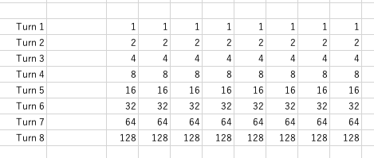
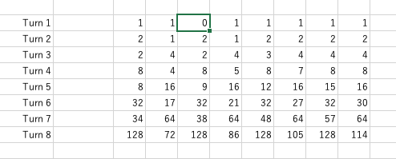
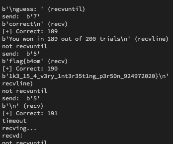

# HSCTF 9

## Others

* algorithms/travelling-salesman ... 右に行って帰ってくるだけ
* algorithms/vending-machine ... DP(大きめの鞄を用意して、ナップサック問題として帰着)
* algorithms/hacking ... 強連結成分分解
* algorithms/hacking-part-2 ... 最小全域木

## Tunnels

問題は要約すると以下のようになります。

> * 200回以下のゲームを行い、187回以上成功するとフラグが得られます
> * 家が8個あり、最初`b40m1k3`くんはどこかの家の中にいます。
> * あなたは8回まで`b40m1k3`くんの居場所をあてることができます。当てた場合はゲームクリアです。
> * 外れた場合、`b40m1k3`くんは隣の家のいずれかに移動します。


9割以上正解する必要があり、普通にやっては到底当てられません。そこで、**最適な選択の手順**を考えます。その前に、ある手順で`b40m1k3`くんの居場所を当てようとした時、その当たる確率はいくつになるか計算します。

8ターンで`b40m1k3`くんの移動ルートを考えてみます。もし当ててもゲームをクリアとしない場合は、Turn8で各家に行くためのルートはどれも128個あります。



もしも、最初に`b40m1k3`くんが3番目の家にいると予想し、外れた場合のルートの数はこのように変動します。



ここで、`b40m1k3`くんは各ターンで`choise = [1 2 3 2 3 4 5 7]` 番目の家にいると予想します。各ターンで当たる確率を計算します。
`(iターン目に当たる確率)=(i-1ターン目で外れる確率)-(iターン単独で当たる確率)`
で、`(iターン単独で当たる確率)`は `(iターン目でb40m1k3くんがchoise[i]番目の家へ移動できるルートの数)/(iターン目でb40m1k3くんが移動できるルートの総和)` です。つまり、iターン目で`b40m1k3`くんが移動できるルートの数がそれぞれ`2, 4, 2, 4, 3, 4, 4, 4`で1番目の家にいると予想した場合、iターン目単独で当たる確率は`2/(2+4+2+4+3+4+4+4)`です。
このように`iターン目に当たる確率`をiを1から8までそれぞれ計算し、総和を取ると、ある手順で`b40m1k3`くんの居場所を当てようとした時、その当たる確率を計算できます。

また、手順は最大8回であり、各手順は8個の家から1つ選びます。8個の家から1つ選ぶ操作は、3bitで識別できます(`2^3=8`)。
よって手順は`3*8=24`bitで識別できます。つまり、bit全探索を用いると手順を全探索することができます。このようにして**最適な選択の手順**を計算しました。

```cpp
#include <iostream>
#include <numeric>
#include <vector>
using namespace std;

vector<int> bestChoise = {-1, -1, -1, -1, -1, -1, -1, -1};
double bestScore = 0;
int lastTail = -1;

double calc(vector<int> choise) {
    vector table(8, vector<int>(8, 1));
    table[0][choise[0]] = 0;
    vector<int> sum(8, 0);
    sum[0] = 7;
    vector<int> choisedScore(8, 0);
    choisedScore[0] = 1;
    for (int i = 1; i < 7; i++) {
        table[i][0] = table[i - 1][1];
        table[i][7] = table[i - 1][6];
        for (int j = 1; j < 7; j++) {
            if (j == 1) {
                table[i][j] = table[i - 1][j - 1] * 2 + table[i - 1][j + 1];
            } else if (j == 6) {
                table[i][j] = table[i - 1][j - 1] + table[i - 1][j + 1] * 2;
            } else {
                table[i][j] = table[i - 1][j - 1] + table[i - 1][j + 1];
            }
        }
        choisedScore[i] = table[i][choise[i]];
        table[i][choise[i]] = 0;
        sum[i] = accumulate(table[i].begin(), table[i].end(), 0);
    }
    {
        table[7][0] = table[6][1];
        table[7][7] = table[6][6];
        for (int j = 1; j < 7; j++) {
            table[7][j] = table[6][j - 1] + table[6][j + 1];
        }
        choisedScore[7] = *max_element(table[7].begin(), table[7].end());
        sum[7] =
            accumulate(table[7].begin(), table[7].end(), 0) - choisedScore[7];
        lastTail =
            max_element(table[7].begin(), table[7].end()) - table[7].begin();
    }
    double score = 0;
    vector<double> indScore(8, 0);
    for (int i = 0; i < 8; i++) {
        indScore[i] = (double)choisedScore[i] / (sum[i] + choisedScore[i]);
    }
    vector<double> term(8, 0);
    term[0] = indScore[0];
    for (int i = 1; i < 8; i++) {
        term[i] =
            term[i - 1] / indScore[i - 1] * (1 - indScore[i - 1]) * indScore[i];
    }
    double ans = accumulate(term.begin(), term.end(), 0.0);
    return ans;
}

int main() {
    for (int bit = 0; bit < 1LL << 21; bit++) {
        vector<int> choise(8, -1);
        for (int i = 0; i < 7; i++) {
            choise[i] = (bit >> (3 * i + 2) & 1) * 4 +
                        (bit >> (3 * i + 1) & 1) * 2 + (bit >> (3 * i) & 1);
        }
        double score = calc(choise);
        if (score > bestScore) {
            choise[7] = lastTail;
            bestScore = score;
            bestChoise = choise;
            cout << "updated! -> " << bestScore << endl;
            for (int i = 0; i < 8; i++) {
                cout << bestChoise[i] + 1 << vector<string>{", ", "\n"}[i == 7];
            }
        }
    }
    cout << endl;
    cout << "schore: " << bestScore << endl;
    for (int i = 0; i < 8; i++) {
        cout << bestChoise[i] + 1 << vector<string>{", ", "\n"}[i == 7];
    }
}
```

計算結果、**5, 2, 7, 4, 4, 7, 2, 5** が最適な選択手法であり、**89.9482**%の確率で`b40m1k3`くんの位置をあてることができます。`187/200=0.935`なので、少し上振れするとフラグが手に入ります。`pwntools`を使って実行します。

```py
from pwn import *
import time
import timeout_decorator

p = remote("tunnels.hsctf.com", 1337)

ret = p.recvline()  # == proof-of-work: disabled ==
print(ret)


@timeout_decorator.timeout(3)
def recv(type="recv", s=""):
    if type == "recv":
        ret = p.recv(numb=9)
        print(ret, "(recv)")
        return ret
    if type == "recvline":
        ret = p.recvline()
        print(ret, "(recvline)")
        return ret
    if type == "recvuntil":
        ret = p.recvuntil(s)
        print(ret, "(recvuntil)")
        return ret


num = [5, 2, 7, 4, 4, 7, 2, 5]
numidx = 0
correct = 0

while True:
    print("[+] Correct:", correct)
    recv("recvline")
    for i in range(1, 8):
        try:
            ret = recv("recvuntil", "guess: ")
        except:
            print("not recvuntil")
        print("send: ", str(num[numidx]).encode())
        p.sendline(str(num[numidx]).encode())
        numidx = (numidx + 1) % 8
        ret = recv()
        if not "incorrect" in str(ret):
            numidx = 0
            correct += 1
            break
```

実行した結果、フラグが得られました。

