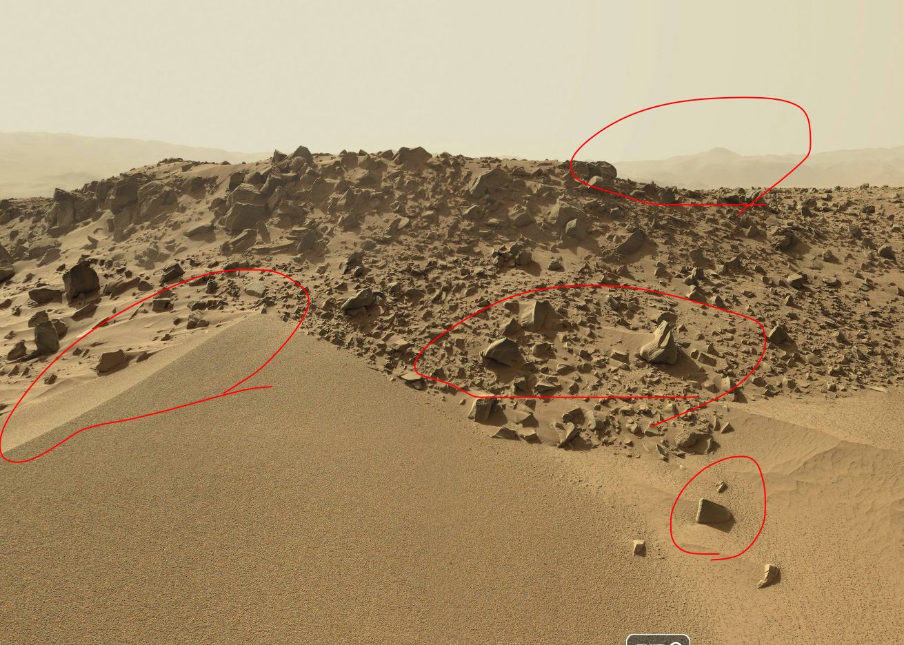
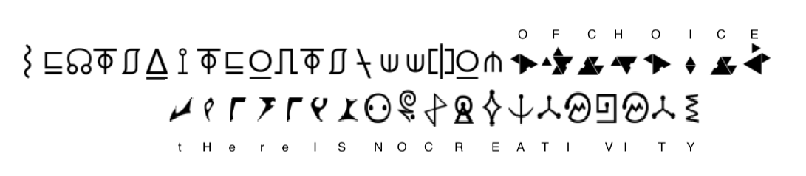
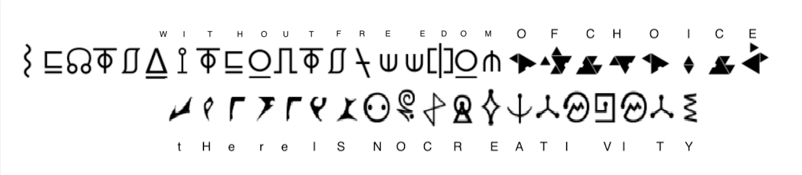
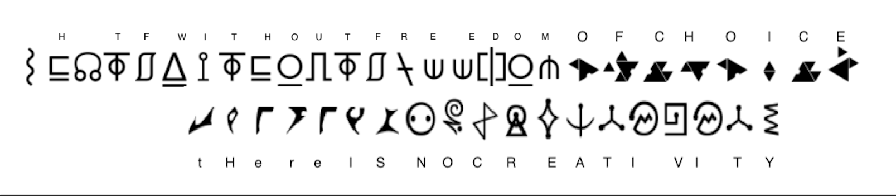

# Writeups

## sanity_check

### Discord


`shctf{4ut0b0ts_r013_0u7}`

### k?

MEE6に`/help`を実行すると`/help commands` が存在することがわかり，`/help commands`を実行すると`!k`コマンドが存在することがわかります．

よって#mee6チャンネルで「!k」と入力して送信するとDMに「k? shctf{WhY_iS_K_BaNnEd}  😭」と送信されます．

`shctf{WhY_iS_K_BaNnEd}`

## web

### R2D2

[http://173.230.138.139/robots.txt](http://173.230.138.139/robots.txt)

`shctf{th1s-aster0id-1$-n0t-3ntir3ly-stable}`

### Space Traveler

スクリプトにこのような箇所があります．

```js
[
  "\x47\x75\x65\x73\x73\x20\x54\x68\x65\x20\x46\x6C\x61\x67",
  "\x73\x68\x63\x74\x66\x7B\x66\x6C\x61\x67\x7D",
  "\x59\x6F\x75\x20\x67\x75\x65\x73\x73\x65\x64\x20\x72\x69\x67\x68\x74\x2E",
  "\x73\x68\x63\x74\x66\x7B\x65\x69\x67\x68\x74\x79\x5F\x73\x65\x76\x65\x6E\x5F\x74\x68\x6F\x75\x73\x61\x6E\x64\x5F\x6D\x69\x6C\x6C\x69\x6F\x6E\x5F\x73\x75\x6E\x73\x7D",
  "\x59\x6F\x75\x20\x67\x75\x65\x73\x73\x65\x64\x20\x77\x72\x6F\x6E\x67\x2E",
  "\x69\x6E\x6E\x65\x72\x48\x54\x4D\x4C",
  "\x64\x65\x6D\x6F",
  "\x67\x65\x74\x45\x6C\x65\x6D\x65\x6E\x74\x42\x79\x49\x64",
];
```

ブラウザのコンソール機能で実行します

```js
['Guess The Flag', 'shctf{flag}', 'You guessed right.', 'shctf{eighty_seven_thousand_million_suns}', 'You guessed wrong.', 'innerHTML', 'demo', 'getElementById']
0: "Guess The Flag"
1: "shctf{flag}"
2: "You guessed right."
3: "shctf{eighty_seven_thousand_million_suns}"
4: "You guessed wrong."
5: "innerHTML"
6: "demo"
7: "getElementById"
```

`shctf{eighty_seven_thousand_million_suns}`

### Flag in Space

`http://172.105.154.14/?flag=`の後ろにフラグを入力し，合っていた数だけフラグが表示される(=私が予測したフラグと正しいフラグを比較し，合っている文字数を教えてくれる)ようです．Pythonを用いて全探索します．

```py
import requests

baseurl = "http://172.105.154.14/?flag=shctf{2_"
chars = "0123456789_}abcdefghijklmnopqrstuvwxyzABCDEFGHIJKLMNOPQRSTUVWXYZ"
size = 8

for _ in range(30):
    for c in chars:
        url = baseurl + c
        print(url)
        html = requests.get(url).text[799:]
        flag = [
            c.replace("<div>", "")
            .replace("</div>", "")
            .replace("</html>", "")
            .replace("\n", "")
            for c in html.split("</div>\n<div>")
        ]
        flag = [c for c in flag if c != ""]
        if len(flag) > size:
            print("I got!! -> " + "".join(flag))
            baseurl += c
            size+=1
            break
```

`shctf{2_explor3_fronti3r}`

### Mysterious Broadcast

アクセスするたびに1文字ずつ`~`,`0`,`1`のいずれかが表示されます．何度もアクセスしてみます．

```py
import requests

url = "http://173.230.134.127/"

while True:
    res = requests.get(url)
    print(res.text, end="")
    url = res.url
```

```txt
~1100011011001011010001101010110010010001111011010011011110100011011000100111011010101100001101011111011001001010110001101100001000101011001110100011101101110110001100001010101011001110100101101000110001011011011010010110100011000111101101101001001110011000011110011101111010111101~1100011011001011010001101010110010010001111011010011011110100011011000100111011010101100001101011111011001001010110001101100001000101011001110100011101101110110001100001010101011001110100101101000110001011011011010010110100011000111101101101001001110011000011110011101111010111101~1100011011001011010001101010110010010001111011010011011110100011011000100111011010101100001101011111011001001010110001101100001000101011001110100011101101110110001100001010101011001110100101101000110001011011011010010110100011000111101101101001001110011000011110011101111010111101~1100011011001
```

`~`を区切り文字して`1100011011001011010001101010110010010001111011010011011110100011011000100111011010101100001101011111011001001010110001101100001000101011001110100011101101110110001100001010101011001110100101101000110001011011011010010110100011000111101101101001001110011000011110011101111010111101`が何度も繰り返されています．

これを**7ビットごとに**区切ってSSCIIに変換します

[cybershef](https://gchq.github.io/CyberChef/#recipe=From_Binary('Space',7)From_Base64('A-Za-z0-9%2B/%3D',true)&input=MTEwMDAxMTAxMTAwMTAxMTAxMDAwMTEwMTAxMDExMDAxMDAxMDAwMTExMTAxMTAxMDAxMTAxMTExMDEwMDAxMTAxMTAwMDEwMDExMTAxMTAxMDEwMTEwMDAwMTEwMTAxMTExMTAxMTAwMTAwMTAxMDExMDAwMTEwMTEwMDAwMTAwMDEwMTAxMTAwMTExMDEwMDAxMTEwMTEwMTExMDExMDAwMTEwMDAwMTAxMDEwMTAxMTAwMTExMDEwMDEwMTEwMTAwMDExMDAwMTAxMTAxMTAxMTAxMDAxMDExMDEwMDAxMTAwMDExMTEwMTEwMTEwMTAwMTAwMTExMDAxMTAwMDAxMTExMDAxMTEwMTExMTAxMDExMTEwMQ)

`shctf{AsciiIsA7BitStandard}`

## Space Buds

Space Budsで検索すると「space buddies」という画像の映画が存在することがわかります．問題文よりその映画の犬の一人がWebサーバに入ったと推測します．「space buddies」の登場人物は[Webサイト](https://buddies.disney.com/super-buddies/characters)に書いてあり，`B-Dawg`,`Budderball`,`Buddha`,`Captain Canine`,`Mudbud`,`Rosebud`の六匹です．順にinputタグとcookieに入れます．

試してみると，Cookieは`Mudbud`をdata-rawは犬の名前のいずれかを入れるとフラグが得られます．

```sh
curl 'http://45.79.204.27/getcookie' -H 'Cookie: userID=Mudbud' --data-raw 'nm=Rosebud'
```


`shctf{tastes_like_raspberries}`

## OSINT

### Launched

まずはexif情報を見ます．

`exiftool -c "%.6f launch.jpg`

ここで重要そうな情報が2つ書かれていました．

```txt
GPS Position                    : 28.586000 N, 80.650689 W
File Modification Date/Time     : 2022:04:03 05:15:21+09:00
```

このGPSの場所は[ジョン F ケネディ・スペース・センター図書館](https://www.google.com/maps/place/%E3%82%B8%E3%83%A7%E3%83%B3+F+%E3%82%B1%E3%83%8D%E3%83%87%E3%82%A3%E3%83%BB%E3%82%B9%E3%83%9A%E3%83%BC%E3%82%B9%E3%83%BB%E3%82%BB%E3%83%B3%E3%82%BF%E3%83%BC%E5%9B%B3%E6%9B%B8%E9%A4%A8/@28.5855911,-80.6514976,228a,35y,348.47h/data=!3m1!1e3!4m13!1m7!3m6!1s0x0:0x49b5622c695396d0!2zMjjCsDM1JzA5LjYiTiA4MMKwMzknMDIuNSJX!3b1!8m2!3d28.586!4d-80.650689!3m4!1s0x88e0b0f1791ada27:0x99b607464ddd3eb!8m2!3d28.5856559!4d-80.6507658)のあたりで，NASAの施設です．
そこで，「NASA rocket 2019/04/11」と検索します．するとこのような記事が出てきます．[Falcon Heavy, SpaceX’s Giant Rocket, Launches Into Orbit, and Sticks Its Landings](https://www.nytimes.com/2019/04/11/science/falcon-heavy-launch-spacex.html)

ロケットの名前は「Falcon Heavy」です．そこで，「Falcon Heavy」の[Wikipedia](https://en.wikipedia.org/wiki/Falcon_Heavy)を見ました．するとPayloadは「Arabsat-6A」ということがわかります．よってフラグは以下の通りです．

`shctf{falcon_heavy_Arabsat-6A}`

## Programming

### FRK War

このような入力が1200個与えられます
`[1267.56, 1130.04, 2588.27, 3338.14, 236.17, 11320.41, 2363.41, 531.25, 1136.72, 1690.02] Romulan Light Fighter`

最終的にこのような数が`Romulan`なのか`Klingons`なのか`Starfleet`なのか当てます．`Starfleet`の時は船を攻撃してはいけないので`N`を，それ以外の時は`Y`を出力します．

`[1250.23, 2817.63, 1820.81, 60.23, 492.89, 44.86, 2013.35, 48.02, 765.08, 6591.08]`

私はまずintelligence reportsからgrepして数列を探索しましたが，そのようなものは存在しませんでした．しかし，intelligence reportsをよく見ると規則性がありそうです．例えば，この辺りを見てみます(一部編集しています)

```txt
[35.05,1941.88,4287.8,2902.9,184.9,2917.93,338.47,2367.21,732.21,4272.74] Klingon
[35.57,2209.72,3959.27,3023.05,134.17,3388.35,880.13,2647.26,460.87,2831.3] Klingon
[35.02,2417.65,1156.22,3055.21,146.49,3348.8,520.05,3973.01,913.65,2746.14] Klingon
[35.13,1575.59,772.11,2883.36,136.16,3894.96,762.43,5266.27,157.02,4019.84] Klingon
[35.32,1770.4,1833.5,4252.28,141.68,2294.74,967.64,2061.43,119.84,5691.19] Klingon
[35.01,1556.79,817.6,2872.76,145.95,3523.56,512.55,4362.45,822.15,5423.58] Klingon
[35.21,1457.47,1882.9,3831.39,154.28,3150.99,646.55,2969.09,276.35,3330.41] Klingon
[35.45,1471.34,4342.47,4768.3,138.08,3532.35,765.62,2374.26,993.36,4643.89] Klingon
[35.18,1790.57,3906.92,4013.17,177.81,2794.02,297.51,2653.02,338.13,4948.36] Klingon
[35.32,1239.93,741.28,3029.71,135.18,2471.76,621.28,3402.43,861.54,5827.88] Klingon
```

Klingonの船の先頭は35が非常に多く見えます．そこで，この問題は数列から特徴量を抽出し，どの船か判別する**機械学習の問題**だと判断しました．私はSVMを使用しました．

```py
from pwn import *
import numpy as np
from sklearn.pipeline import make_pipeline
from sklearn.preprocessing import StandardScaler
from sklearn.svm import SVC

clf = make_pipeline(StandardScaler(), SVC(gamma="auto"))

io = remote("0.cloud.chals.io", 29511)

X = []
y = []

while True:
    line = str(io.recvline())[2:-3]
    if line == "=" * 112:
        break
    if line[0] == "=":
        continue
    print(line)
    line = line.split("]")
    ships = line[0]
    country = line[1][1:].split(" ")[0]
    ships = eval(ships + "]")
    X.append(ships)
    if country == "Romulan":
        y.append(0)
    elif country == "Klingon" or country == "Klington":
        y.append(1)
    elif country == "Starfleet":
        y.append(2)

X = np.array(X)
y = np.array(y)

clf.fit(X, y)

while True:
    line = str(io.recvline())[2:-3]
    print(line)
    if line[:9] == "Congrats!":
        continue
    if line[:20] != "A ship approaches:  ":
        continue
    line = eval(line[20:])
    _ = str(io.recv())[2:-1]
    payload = "N"
    res = clf.predict([line])
    if res[0] != 2:
        payload = "Y"
    print("fire ->", payload)
    io.send(payload + "\n")
```

実行してから数秒後，フラグが得られました．

`Congrats, the war is over: shctf{F3Ar-1s-t4E-true-eN3my.-Th3-0nly-en3my}`

`shctf{F3Ar-1s-t4E-true-eN3my.-Th3-0nly-en3my}`

## Curious?

Google Lensを使用すると[NASAのサイト](https://nasa-jpl.github.io/SPOC/)が出てきます．


しかし，このサイトからフラグの情報が得られません．私はかなり多くのサイトから画像を検索しましたが，類似画像は見つからなかったので，動画から検索することにしました．

Youtubeで「mars curiosity SOL dune」と検索すると[それらしき動画](https://www.youtube.com/watch?v=ggP5dnvZFlo)がありました．

この動画の引用元が下記のサイトです(こちらの方が見やすい)．

https://www.360cities.net/image/mars-panorama-curiosity-solar-day-530



赤枠の箇所が問題の写真と一致しているように見えます．答えは`shctf{SOL_530}`だと思い，提出しましたがincorrectでした．
SOLの１単位は(わかりませんが)あまり長い距離ではありません．

これがSOL530


これがSOL534


このように，あまり移動していないことがわかります．そこで，私は`SOL_527`から順に入力しました．答えは533でした．

`shctf{SOL_533}`

## Crypto

### Mobile Infantry

パスワードを入力するとフラグが得られる仕組みです．

```txt
Welcome to Ricos Roughnecks. We use 1-time-pads to keep all our secrets safe from the Arachnids.
Here in the mobile infantry, we also implement some stronger roughneck checks.
Enter pad > 
```

パスワードは以下の形式である必要があります．

1. 全部で38文字
2. 先頭20文字は大文字
3. 後半18文字は小文字
4. 前半19文字は，次の文字が文字コードで1多くする(ABC...)
5. 20文字目以降は，次の文字が文字コードで1少なくする(zyx...)

まず私は`ABCDEFGHIJKLMNOPQRSTzyxwvutsrqponmlkji`を入力しました．すると`[+] Welcome the mobile infantry, keep fighting.`とだけ出力され，フラグえられませんでした．
そこでDiscordを見てみるとこのようなヒントが出ていました．

```py
pad = input("Enter pad > ")
result = otp(secret, pad)
if (result == flag):
    print("[+] The fight is over, here is your flag: %s" % result)
else:
    print("[+] Welcome the mobile infantry, keep fighting.")
```

今回正しい`pad`となる文字は(len(upper_chers)-20+1)*(len(lower_chers)-18+1)=7*9=63しかありません．例えばこのようなものです．

```txt
ABCDEFGHIJKLMNOPQRSTzyxwvutsrqponmlkji
BCDEFGHIJKLMNOPQRSTUzyxwvutsrqponmlkji
CDEFGHIJKLMNOPQRSTUVzyxwvutsrqponmlkji
...
GHIJKLMNOPQRSTUVWXYZtsrqponmlkjihgfedc
GHIJKLMNOPQRSTUVWXYZsrqponmlkjihgfedcb
GHIJKLMNOPQRSTUVWXYZrqponmlkjihgfedcba
```

よってこれらを全探索します．

```py
from pwn import *


up = "ABCDEFGHIJKLMNOPQRSTUVWXYZ"
low = "abcdefghijklmnopqrstuvwxyz"

for i in range(7):
    for j in range(9):
        up_sub = up[i : i + 20]
        low_sub = "".join(list(reversed(low[j : j + 18])))
        pad = up_sub + low_sub
        io = remote("0.cloud.chals.io", 27602)

        for _ in range(100):
            line = str(io.recvline())[2:-3]
            print(line)
            if (
                line
                == "Here in the mobile infantry, we also implement some stronger roughneck checks."
            ):
                break
        line = str(io.recvline())
        line = str(io.recv())[2:-1]
        print(line)

        io.send(pad + "\n")
        for _ in range(7):
            line = str(io.recvline())[2:-3]
            print(line)
            if "flag" in line:
                exit()
            if "[+] Welcome" in line:
                break
```

最終的にフラグが出力されました．

`[+] The fight is over, here is your flag: shctf{Th3-On1Y-G00d-BUg-I$-A-deAd-BuG}`

`shctf{Th3-On1Y-G00d-BUg-I$-A-deAd-BuG}`

## Khaaaaaan!

暗号文を見ると4つの難解なフォントでフラグが書かれているように思えます．後半3つはGoogle Lensなどを用いるとすぐ出てきますが，最初がわかりません．

https://de.ffonts.net/Covenant.font.download
https://ja.m.wikipedia.org/wiki/%E3%83%95%E3%82%A1%E3%82%A4%E3%83%AB:KLI_pIqaD.svg
https://www.pinterest.jp/pin/460704236877423332/

ここまでの暗号文を一度復号します．



`of choice there is no creativity`

Google で「of choice there is no creativity」と検索します．

`Without freedom of choice, there is no creativity`

が大量に出てきます．換字式暗号なので，同じ記号は同じ文字を意味します．「Without freedom」はあっていそうです．



これをもとに最初の5文字も当てはめてみます．



おそらく最初の5文字は`shctf`でしょう．これを`_`で区切ってフラグの形式で提出するとフラグが得られます．

`shctf{without_freedom_of_choice_there_is_no_creativity}`

## Forensics

### Space Captain Garfield

がぞうごGoogle Colabで検索するとこのようなサイトが出てきます．

https://king-harkinian.fandom.com/wiki/Garfield?file=Trekfield.jpg


これを問題の画像に当てはめます．


ただの換字式暗号です．するとフラグは`shctf{LASAGNALOVER}`となります．

`shctf{LASAGNALOVER}`

## Rev

## Cape Kennedy

与えられるプログラムより，パスワードは8文字で合計すると713，??ABBACC 形式，特殊文字は使用しないようです．正規表現にすると`r'([A-z0-9][A-z0-9]([A-z0-9])([A-z0-9])\3\2([A-z0-9])\4)'`のようになります．

私はまずこのようなプログラムを書きましたが数十万個のパスワード候補が出てしまいました．

```py
if __name__ == "__main__":
    alphabet = "abcdefghijklmnopqrstuvwxyzABCDEFGHIJKLMNOPQRSTUVWXYZ0123456789"

    for c1 in tqdm(alphabet):
        for c2 in alphabet:
            for c3 in alphabet:
                for c4 in alphabet:
                    for c5 in alphabet:
                        password = f"{c1}{c2}{c3}{c4}{c4}{c3}{c5}{c5}"
                        if check(password):
                            print(password)
```

[regex word search site](http://thewordsword.com/)にもそのような単語はなく，かなり悩んだ末，問題文とDiscordをよくみました．

> remember this is a themed ctf, the answer is NOT random
> Its a famous thing from the US Space Program(discord)

「US Famous Space Program」で検索すると[List of space programs of the United States](https://en.wikipedia.org/wiki/List_of_space_programs_of_the_United_States)が出てきます．しかしこのページのテキストには上記の正規表現に一致する単語はありません．
そこで，私はwikipediaをクロールすることにしました．プログラムはこれです．

```py
import requests
import re
from tqdm import tqdm
url = "https://en.wikipedia.org/wiki/List_of_space_programs_of_the_United_States"


html = requests.get(url).text

href = re.findall(r'<a href="(.*?)"', html)
urls = []
for h in href:
    if h[0]=='/':
        urls.append("https://en.wikipedia.org"+h)
    elif h[0]=="#":
        continue
    else:
        urls.append(h)

text = ""

for u in tqdm(urls):
    html = requests.get(u).text
    text += html

passwd = re.findall(r'([A-z0-9][A-z0-9]([A-z0-9])([A-z0-9])\3\2([A-z0-9])\4)', text)
print(passwd)
```

[List of space programs of the United States](https://en.wikipedia.org/wiki/List_of_space_programs_of_the_United_States)から1回のリンクを踏んだ先にあるコンテンツから正規表現で単語を探しています．
最終的に出力から「Apollo11」が出てきました．

`shctf{Apollo11}`

