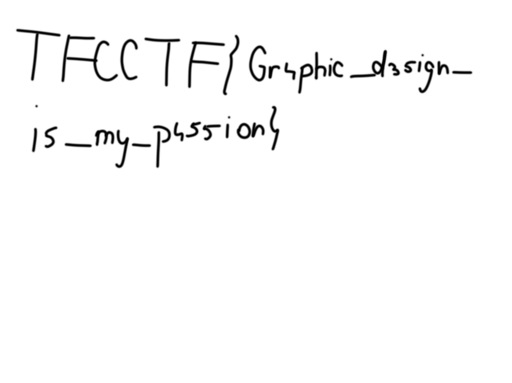

## MISC

### RULES

ルールに書いてあります．
`TFCCTF{Fl4Gs_f0r_3v3ry0n3!!!^@&#@$?~:}`

### LOST MY HEAD

`exiftool -c '%.6f' -GPSPosition img.heic`

GPS Position                    : 46.780761 N, 23.615072 E
https://www.google.co.jp/maps/@46.7807559,23.6150516,3a,75y,165.56h,83.45t/data=!3m7!1e1!3m5!1sO_soQ6RVc1Smy5pF2KZvkw!2e0!6shttps:%2F%2Fstreetviewpixels-pa.googleapis.com%2Fv1%2Fthumbnail%3Fpanoid%3DO_soQ6RVc1Smy5pF2KZvkw%26cb_client%3Dmaps_sv.tactile.gps%26w%3D203%26h%3D100%26yaw%3D59.896667%26pitch%3D0%26thumbfov%3D100!7i13312!8i6656?hl=ja

`TFCCTF{Simion_Musat_4}`

## CRYPTO

### SEA LANGUAGE 1

モールス記号なので，これを変換するだけです．

### SEA LANGUAGE 2

`.`を`0`に，`_`を`1`に置換してから，binary to asciiをします．

### HOLIDAY

Google翻訳によると`Maui: Mai hele Mai i kēia lā aia nā ʻīlio`はハワイ語で`don't come today there are dogs`という意味らしいです．

`TFCCTF{don't_come_today_there_are_dogs}`

## Web

### MACDONALDS

[URL](https://macdonalds-web.challenge.ctf.thefewchosen.com)にアクセスします．

どうやら同じディレクトリ内に隠しているフォルダかファイル(リンクが貼られていないけどたどれる)があって，そのファイル名を当てる問題です．問題文に作者はMac OSを使っていると書かれているので，これを利用します．

[https://macdonalds-web.challenge.ctf.thefewchosen.com/.DS_Store](https://macdonalds-web.challenge.ctf.thefewchosen.com/.DS_Store)にアクセスすると.DS_Storeファイルが手に入ります．これはディレクトリ内のファイル情報が入っています．
DS_Storeファイルはこのサイトで解析できます．
[https://labs.internetwache.org/ds_store/](https://labs.internetwache.org/ds_store/)

secretsディレクトリがあるらしいです．secretsディレクトリ内の.DS_Storeを確認します．

[https://macdonalds-web.challenge.ctf.thefewchosen.com/secrets/.DS_Store](https://macdonalds-web.challenge.ctf.thefewchosen.com/secrets/.DS_Store)

すると，`5973b4cc1d61c110188ee413cddb8652.php`というファイルがあるらしいです．

https://macdonalds-web.challenge.ctf.thefewchosen.com/secrets/5973b4cc1d61c110188ee413cddb8652.php

`TFCCTF{.D5_S70r3_1s_s0_4nn0ying_wh3n_c0mp1l1ng_j4rs_y0urs3lf}`

### FORENSICS

### AAAAA

バイナリエディタで先頭と末尾の`AAA...`を削除すると斯のような画像が出てくる

`TFCCTF{Gr4phic_d35ign_i5_my_p455ion}`
