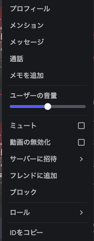

# Discord:OSINT:pts

Find the account creation date of one of our discord channel admins (4dam).

Note: Please put the date in this format YYYY/MM/DD for submission, like this:
SBCTF{1970/01/01}

# Solution

Discordを開発者モードにします．これは設定からできます．

その後，ユーザを指定すると「IDをコピー」というボタンが増えます．

ID: 808684903301775360

以下のサイトで作成日を確認します．

[https://hugo.moe/discord/discord-id-creation-date.html](https://hugo.moe/discord/discord-id-creation-date.html)

## SBCTF{2021/02/09}