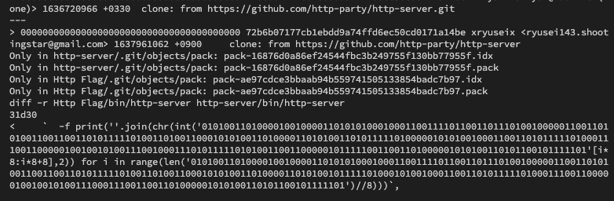

# Http flag:Misc:pts

# Solution

OSSのようなファイルが与えられます．`.git/config`ファイルをみましょう．

`url = https://github.com/http-party/http-server.git`

実際のOSSを少し書き換えたようなファイルであることがわかりました．ここで，このレポジトリをcloneして，差分を見てみましょう．

怪しい変更がありました．



```py
print(''.join(chr(int('010100110100001001000011010101000100011001111011001101110100100000110011010100110011001101011111010011010011000101010011010000110101001101011111010000010101001000110011010111110100011100110000010010010100111001000111010111110101001100110000010111110011001101000001010100110101100101111101'[i*8:i*8+8],2)) for i in range(len('010100110100001001000011010101000100011001111011001101110100100000110011010100110011001101011111010011010011000101010011010000110101001011111010001010010001100110101111101000111001100000100100101001110001110011001101000001010100110101100101111101')//8)))
```

フラグが途中までしか出力されません．

`SBCTF{7H3S3_M1SCS_AR3_G0ING_S0`

このプログラムを見てみると，後半の`len`関数の中の文字数に応じて出力される文字数が変わっているようです．適当な文字を追加してみましょう．

```py
print(
    "".join(
        chr(
            int(
                "010100110100001001000011010101000100011001111011001101110100100000110011010100110011001101011111010011010011000101010011010000110101001101011111010000010101001000110011010111110100011100110000010010010100111001000111010111110101001100110000010111110011001101000001010100110101100101111101"[
                    i * 8 : i * 8 + 8
                ],
                2,
            )
        )
        for i in range(
            len(
                "0101001101000010010000110101010001000110011110110011011101001000001100110101001100110011010111110100110100110001010100110100001101010010111110100010100100011001101011111010001110011000001001001010011100011100110011010000010101001101011001011111010000000000000000000000000000000000000000000"
            )
            // 8
        )
    )
)
```

フラグが出力されました．

## SBCTF{7H3S3_M1SCS_AR3_G0ING_S0_3ASY}