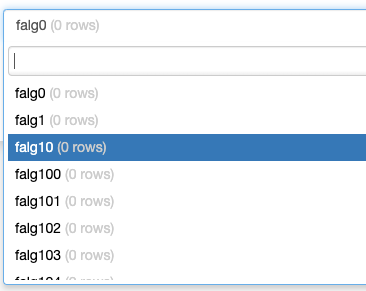
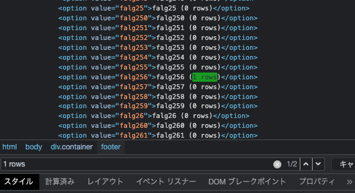
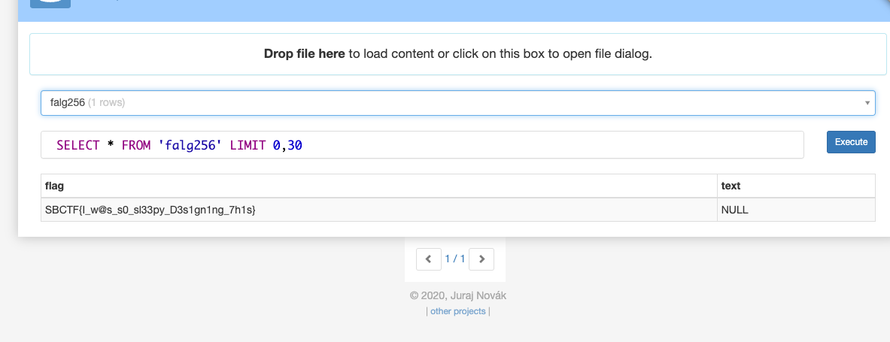

# Query the Flag:Misc:pts

Query the flag

# Solution

SQLiteでデータベースファイルが与えられます．このサイトを使用して中身をみます．

[https://inloop.github.io/sqlite-viewer/](https://inloop.github.io/sqlite-viewer/)

大量の0 rowsのテーブルがあります．

開発者ツールで`1 rows`を検索します．

256番目のテーブルにフラグがあります．

## SBCTF{I_w@s_s0_sl33py_D3s1gn1ng_7h1s}