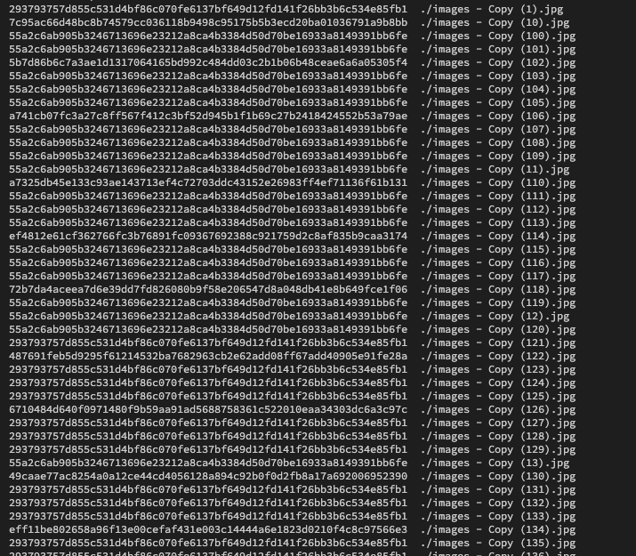

# They all look the same:Misc:pts

They are slightly different

# Solution

同じようなファイルが大量に送られます．まずはsha256ハッシュ値を見てみます．

また，exif情報を見てみます．

Descriptionなどに変なメッセージが見えます．全部見てみましょう．

フラグはこのように思えます．

`SBCTF{H0w_c0uld_y0u_d!st!ngu!shS_SSS!SSSmSSS@SSSgSSS3SSSsSSS_SSS`

しかし，このままだと不自然なので，少し整形します．

## SBCTF{H0w_c0uld_y0u_d!st!ngu!sh_!m@g3s_}