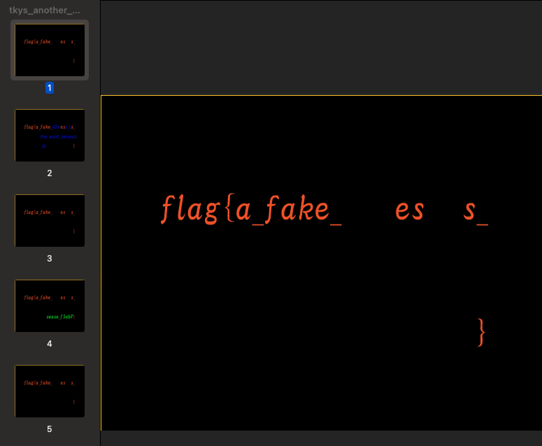

<!-- @format -->

# setodaNoteCTF

URL: [https://ctf.setodanote.net/](https://ctf.setodanote.net/)

|         項目         |       結果       |
| :------------------: | :--------------: |
|       チーム名       | Tsukushi YOSHIMI |
|         順位         |        1         |
| チームで解いたスコア |       8600       |
| チームで解いた問題数 |        70        |
|  個人で解いた問題数  |        8         |
|  個人で解いたスコア  |       1130       |

提出後に思い出して書いてるので，フラグとか間違っていたらすみません．

## OSINT

### Dorks ( 362 solves / 50 points )

Google 検索コマンドを調べると以下のサイトが出てきました．

[https://ahrefs.com/blog/google-advanced-search-operators/](https://ahrefs.com/blog/google-advanced-search-operators/)

`inurl`コマンドを使用します．

```txt
flag{inurl:login.php}
```

### N-th_prime ( 41 solves / 200 points ) \[FirstAC\]

これ結構難しいです．まずは`72057594037927936=2^56`であることがわかります．素数カウント関数の結果を表示している[サイト](http://www.primefan.ru/stuff/primes/table.html)ではフラグの先頭 4 文字は`1991`と書かれています．その時，脳裏に OEIS を思い出し，OEIS で数列として検索すると[出てきます](https://oeis.org/A033844/b033844.txt)．`56 2991614170035124397`
と書かれているので

```txt
flag{2991614170035124397}
```

## Crypto

### vul_rsa_01 ( 170 solves / 150 points )

```txt
c: 39119617768257067256541748412833564043113729163757164299687579984124653789492591457335

n: 13373801376856352919495636794117610920860037770702465464324474778341963699665011787021257

e: 65537
```

N が小さすぎます．[factordb](http://factordb.com/index.php?query=13373801376856352919495636794117610920860037770702465464324474778341963699665011787021257)で素因数分解してもらいます．

```txt
13373801376856352919495636794117610920860037770702465464324474778341963699665011787021257 = 3058517013146002381763962882964790715736519 * 4372642466716249946441875327733923056149624303
```

あとは RSA を復号するだけです．

```py
# !pip install pycrypto
from Crypto.Util.number import * #inverse()を使う

# 公開鍵
N = 13373801376856352919495636794117610920860037770702465464324474778341963699665011787021257
E = 65537
# 秘密鍵
p = 3058517013146002381763962882964790715736519
q = 4372642466716249946441875327733923056149624303
# 暗号文
C = 39119617768257067256541748412833564043113729163757164299687579984124653789492591457335

d = inverse(E, (p - 1) * (q - 1))

ans = pow(C, d, N)
print(long_to_bytes(ans))
```

```txt
flag{weak_rsa_can_be_decrypted!}
```

### vul_rsa_02 ( 139 solves / 250 points )

```txt
c: 227982950403746746755552239763357058548502617805036635512868420433061892121830106966643649614593055827188324989309580260616202575703840597661315505385258421941843741681

n: 314346410651148884346780415550080886403387714336281086088147022485674797846237037974025946383115524274834695323732173639559408484919557273975110018517586435379414584423

e: 66936921908603214280018123951718024245768729741801173248810116559480507532472797061229726239246069153844944427944092809221289396952390359710880636835981794334459051137
```

E がデカすぎます．なにも考えずに 65537 でいいのにな......

E が大きい場合は Wiener's Attack という方法で E, N から N の素因数分解が可能です．本プログラムはブログ・[よっちんのブログ](https://yocchin.hatenablog.com/entry/2017/03/05/192000)を参考にしました．

```py
from fractions import Fraction

def continued_fractions(n,e):
    cf = [0]
    while e != 0:
        cf.append(int(n/e))
        N = n
        n = e
        e = N%e
    return cf

def calcKD(cf):
    kd = list()
    for i in range(1,len(cf)+1):
        tmp = Fraction(0)
        for j in cf[1:i][::-1]:
            tmp = 1/(tmp+j)
        kd.append((tmp.numerator,tmp.denominator))
    return kd

def int_sqrt(n):
    def f(prev):
        while True:
            m = (prev + n/prev)/2
            if m >= prev:
                return prev
            prev = m
    return f(n)

def calcPQ(a,b):
    if a*a < 4*b or a < 0:
        return None
    c = int_sqrt(a*a-4*b)
    p = (a + c) /2
    q = (a - c) /2
    if p + q == a and p * q == b:
        return (p,q)
    else:
        return None

def wiener(n,e):
    kd = calcKD(continued_fractions(n,e))
    for (k,d) in kd:
        if k == 0:
            continue
        if (e*d-1) % k != 0:
            continue
        phin = (e*d-1) / k
        if phin >= n:
            continue
        ans = calcPQ(n-phin+1,n)
        if ans is None:
            continue
        return (ans[0],ans[1])

e = 227982950403746746755552239763357058548502617805036635512868420433061892121830106966643649614593055827188324989309580260616202575703840597661315505385258421941843741681
n = 314346410651148884346780415550080886403387714336281086088147022485674797846237037974025946383115524274834695323732173639559408484919557273975110018517586435379414584423

(p,q) = wiener(n,e)

print('p = ', str(p))
print('q = ', str(q))
```

P と Q が出力されます．

```py
p = 903296723535367266060988005858251165436301698040255270546009258271726621105072654951
q = 347999059955453396487784535198377540330545703583036100411648705038922144575641923073
```

前述のプログラムを使って RSA を復号します．変な文字が入っていますが，最後にフラグが記述されています．

```txt
b'\x02my\xa6\xfb\xa2t\x19X\xce\x82F(U\xa9n\xc4\xdc\x16#\x13<\xfc4\x15y\x92\x0b\xef\xc0.\xb7\xb9\xe0\xa3\xbb\xb8r\x00flag{197_Michael_J_Wiener_673}'
```

```txt
flag{197_Michael_J_Wiener_673}
```

## Forensics

### tkys_another_day ( 126 solves / 100 points )

チームメンバー「この問題さっきから解析してるんだけど全然わからねえ」  
僕「ちょっとファイル開いてみるわ」  
僕「ファイル開いたらフラグ載ってるんだが...?」

Mac で開きます．フラグ載ってました．以上(笑)．作問者さんごめんなさいね 🤪



### CSIRT_asks_you_01 ( 99 solves / 150 points )

Security.evtx というよくわからないファイルが配られましたが，チームメンバーが CSV に変換してくれました．
すると下記のような情報が入ったファイルが開けます．

```csv
"2021/07/19 5:10:33","情報","Microsoft-Windows-Security-Auditing","4625","アカウントがログオンに失敗しました。
;
;サブジェクト:
;	セキュリティ ID:		S-1-0-0
;	アカウント名:		-
;	アカウント ドメイン:		-
;	ログオン ID:		0x0
;
;ログオン タイプ:			3
;
;ログオンを失敗したアカウント:
;	セキュリティ ID:		S-1-0-0
;	アカウント名:		stella
;	アカウント ドメイン:
;
;エラー情報:
;	失敗の原因:		ユーザー名を認識できないか、またはパスワードが間違っています。
;	状態:			0xC000006D
;	サブ ステータス:		0xC000006A
;
```

問題文には

> 不正な方法によってネットワーク経由のログインが成功した

と書かれているので，`ネットワーク経由`，`ログイン`，`成功`の条件で検索します．検索は正規表現を用います．
ログイン成功のイベント ID は 4624，ネットワーク経由の場合はログオンタイプという情報が与えられてこの値が 3 となります．検索コマンドは以下のものです．(コンテスト中に書いたもので，もっと綺麗にはなりますが...)

```txt
"4624","アカウントが正常にログオンしました。\n.*\n.*\n.*\n.*\n.*\n.*\n.*\n.*\n;    ログオン タイプ:        3
```

すると検索結果は 3 箇所出てくるので，全部試すと 2021/07/19 5:09:21 のイベントで通ります．最後に時刻を JST から UTC に変換します．

```txt
flag{2021/07/18_20:09:21_4625}
```

## Programming

### ZZZIPPP ( 263 solves / 80 points )

Python の zipfile モジュールを使うと簡単に解凍できます．フラグは忘れました．

### EZZZIPPP ( 180 solves / 150 points )

Python の zipfile モジュールを使うと簡単に解凍できます．パスワードがあっても以下の関数で解凍できます．フラグは忘れました．

```py
def unzip_with_pwd(filename, path=".", pwd=b""):
    with zipfile.ZipFile(filename, "r") as zip_file:
        try:
            zip_file.extractall(path=path, pwd=pwd)
            print("\n{} is extraction successful!")
            exit()
        except:
            print("\r{}".format(pwd), end="")
```

以上！