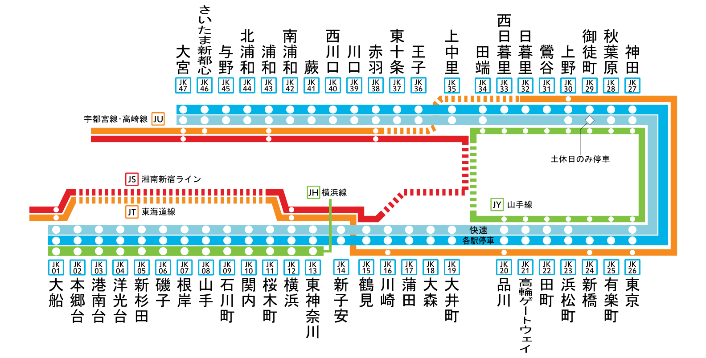
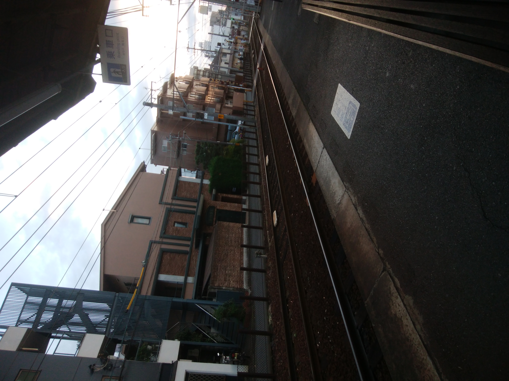
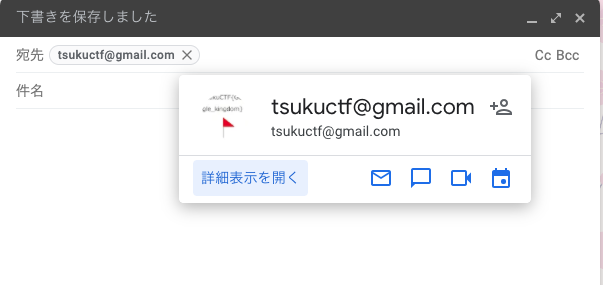
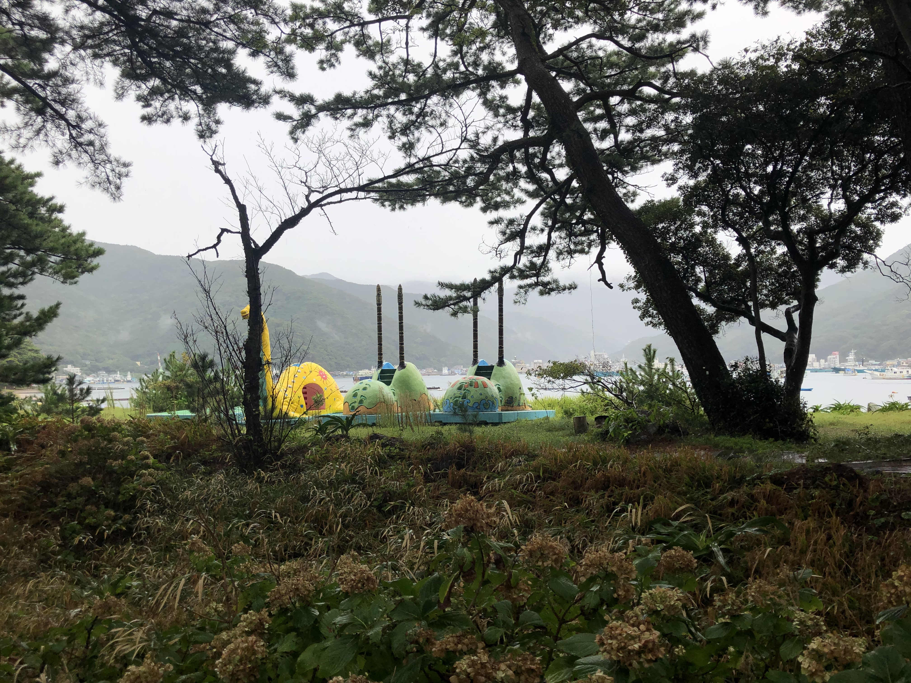

<!-- @format -->

# TsukuCTF 2021 Writer & Tester Writeup

## [公式Writeupはこちら](https://fans.sechack365.com/ctf/tsukuctf2021/)

## Welcome

> TsukuCTF 2021にご参加いただきありがとうございます。フラグの形式は全て`TsukuCTF{}`です。この問題のフラグは[Twitter](https://twitter.com/tsukuctf)のアカウント名です。質問などはTwitterのDMにお願い致します。
  ※トップページのロゴに何か隠れています…  (競技には無関係です)

問題文のリンクに従い[Twitter](https://twitter.com/tsukuctf)を開きます。するとアカウント名が`TsukuCTF{2021}`となっています。
また、Notificationsで述べた通り、`TsukuCTF{@tsukuctf}`や`TsukuCTF{tsukuctf}`もフラグとなります。

```txt
TsukuCTF{2021}
```

## digits

> コンピュータは高速に正しく計算してくれますが、昔のコンピュータは今ほど正確に計算できないことがありました。現在もハードウェアの故障などが原因でとても低い確率でコンピュータは計算をミスするでしょう。
運が良いあなたならこの問題が解けるはずです。10 桁の好きな数字をクエリパラメータ `q` に入れて、神に祈りましょう。
`https://tsukuctf.sechack365.com/problems/digits`
※この問題では`/problems/digits`以下のみを用います。
他の問題`/problems/<name>`などと混同しないよう注意してください。

プログラムはこれです．

```py
from typing import Optional
from fastapi import FastAPI
import random

app = FastAPI()

FLAG = "TsukuCTF{}"


@app.get("/program/digits/")
def main(q: Optional[str] = None):
    if q == None:
        return {
            "msg": "please input param 'q' (0000000000~9999999999).  example: /?q=1234567890"
        }
    if len(q) != 10:
        return {"msg": "invalid query"}
    if "-" in q or "+" in q:
        return {"msg": "invalid query"}
    try:
        if not type(int(q)) is int:
            return {"msg": "invalid query"}
    except:
        return {"msg": "invalid query"}

    you_are_lucky = 0

    for _ in range(100):
        idx = random.randrange(4)
        if q[idx] < "0":
            you_are_lucky += 1
        if q[idx] > "9":
            you_are_lucky += 1

    if you_are_lucky > 0:
        return {"flag": FLAG}
    else:
        return {"msg": "Sorry... You're unlucky."}
```

ちなみにFastAPIが使われているのは僕の好みです．
入力`q`のチェックを一つずつ確認しましょう．

### 1. `q`は`None`であってはならない

何か入れましょう．

### 2. `q`は文字列型である

`def main(q: Optional[str] = None):` と書かれています．

### 3. `q`の長さは 10 であ

`len(q) != 10:` と書かれています．

### 4. `q`に`+`や`-`が含まれない

書いてある通りです．

### 5. `q`のある文字が 0 未満または 9 以上になることがある

つまり，0~9 以外の文字を 1 つでもこの時点で入って入れば良いです．

### まとめ

結論から言うと，`+100000000`や`+++1111111`や`+294287356`など，`+`が 1 つ以上かつその後ろに数字が 1 つ以上入っていれば何でも大丈夫です．  
URL には`+`という文字を入れることができます．これはデリミタの一種で，半角スペースの扱いになります．  
正解の文字列は長さが 10 で`-`が含まれておらず，`+`は半角スペースに変換されるので`+`も入っておらず，`int`関数で変換可能であり，ある文字が 0 未満または 9 以上になることがあります．

### お詫び

この問題いっぱいミスをしましたすみませんでした．  
まず最初はファイルを与えておらず，ブラックボックスになっていました．  
また，最初は`@app.get("/program/digits/")`が`@app.get("/program/digits")`となっていて，`/program/digits/?q=12345678090`とアクセスするとlocalhostへリダイレクトされるバグがありました．Yちゃんが気づいて直してくれました．本当にすみませんでした......  
あと`idx = random.randrange(4)`がなんで`idx = random.randrange(10)`ではないかというと，僕のミスです(あまり難易度は変わらないので無視しました)．

```txt
TsukuCTF{you_are_lucky_Tsukushi}
```

## TORItsukushi

# TORItsukushi

> 文字列 `TSUKUSHI` を可能な限り何度も取りつくしてください。残った文字列がフラグです。またフラグの部分文字列に `TSUKUSHI` は含まれていません。

単純に `TSUKUSHI` を取り除けば良いです。ただし， `TSUTSUKUSHIKUSHI` のような入れ子構造になっている文字も削除することと，大文字小文字を区別する必要があります．

```py
with open("many_tsukushi.txt") as f:
    tsukushi = f.read()

while True:
    before_tsukushi = tsukushi
    after_tsukushi = before_tsukushi.replace("TSUKUSHI", "")
    if before_tsukushi == after_tsukushi:
        break
    tsukushi = after_tsukushi

print(tsukushi)
```

```txt
TsukuCTF{Would_you_like_some_fresh-baked_Tsukushi?}
```

## ramen

> ハッカーにとってラーメンは必須の飲み物だといわれています。写真のラーメン店の本店のインスタグラムIDを特定してください。


Google レンズを使用すると以下のように銀座篝であることがわかります。

```txt
TsukuCTF{kagari_honten}
```

## shop

> Tsukushiくんはショッピングモールにデートに来ましたが、相手がいなかったことに到着してから気づきました。帰ろうと思いましたがここがどこかわかりません。動画内に映っているショッピングモールの店舗名を特定してください。

イオンモールと橋がすぐに見えることから，かなり大きな川または湖付近のイオンモールであることがわかります．
ここで，イオンモールにある看板から，店舗数が少なそうなベビーザラスがあるイオンモールより，イオンモール草津と特定できます．

```txt
TsukuCTF{イオンモール草津}
TsukuCTF{草津}
```

## train

> 画像が撮られた駅名を答えてください。
> - **この問題は5回までしか提出できません。**
> - 駅名は[東京近郊路線図](https://www.jreast.co.jp/map/pdf/map_tokyo.pdf)内に記載されている駅名の英語表記を使用します。
> - 駅名がそのままフラグになります。仮に駅名が`Kyoto`の場合、フラグは`TsukuCTF{Kyoto}`となります。


画像から京浜東北線と山手線の両方が走っている駅だとわかります．


(https://ja.wikipedia.org/wiki/%E4%BA%AC%E6%B5%9C%E6%9D%B1%E5%8C%97%E7%B7%9A より引用)

路線図より，品川-田端のどれかになります．ここで，画像をよく見ると別のホームでは品川行きの電車があります．つまり今いるホームは田端方面行きです，田端方面行きかつ東京上野方面行きであることがわかるので，品川-有楽町のどれかに絞れます．また，快速が通過していることから新橋または有楽町であることがわかり，北改札があるのは新橋だけです．

```txt
TsukuCTF{Shimbashi}
```

## train2

> 今いる駅名を答えてください．駅名は漢字で答えてください．例: 京都駅の場合は`TsukuCTF{京都}`がフラグになります．

画像に「出町」という文字があるので，「出町 駅」で検索すると「出町柳駅」がヒットする．出町柳を検索しても，画像とは違う駅なので，その前後の駅を確認すると，元田中駅が画像の駅であることがわかる．

https://www.google.com/maps/@35.0349579,135.7813721,3a,75y,23.08h,77.26t/data=!3m8!1e1!3m6!1sAF1QipPvDFkrjpzyAn7HUon6fOL_bbH6HR48-q9DjxV3!2e10!3e11!6shttps:%2F%2Flh5.googleusercontent.com%2Fp%2FAF1QipPvDFkrjpzyAn7HUon6fOL_bbH6HR48-q9DjxV3%3Dw203-h100-k-no-pi-2.9665244-ya241.67862-ro-1.0298401-fo100!7i5376!8i2688



```txt
TsukuCTF{元田中}
TsukuCTF{元田中駅}
TsukuCTF{もとたなか駅}
```

## Beach

> これは東京近郊に住んでいる筑紫くんと素日華くんの会話です。
> 
> 筑紫「もう待ち合わせ時間なんだけど、まだ？」  
> 素日華「もう少し待ってくれ！もうすぐ待ち合わせ場所の駅に着くんだけど...」  
> 筑紫「今どこにいる？写真送ってくれない？」  
> 素日華「おっけい！」
> 
> 素日華くんは 2 枚の画像を筑紫くんに送りました。この画像をもとに、筑紫くんと素日華くんの待ち合わせ場所を特定してください。以下の制約に従ってください。
> 
> - **この問題は10回までしか提出できません。**
> - 待ちあわせ場所は JR の駅です。
> - 写真を撮られた座標からユークリッド距離が一番近い駅が待ち合わせ場所です。
> - 駅名は[東京近郊路線図](https://www.jreast.co.jp/map/pdf/map_tokyo.pdf)内に記載されている駅名の英語表記を使用します。
> - 駅名がそのままフラグになります。仮に駅名が `Kyoto` の場合、フラグは `TsukuCTF{Kyoto}` となります。


2枚目の画像に見える`C`のオブジェから辿る方法が一番簡単でしょう．`海岸 C`で検索すると出てきます．

```txt
TsukuCTF{Chigasaki}
```

## cafe

> 私の彼氏([@7aru7aru](https://twitter.com/7aru7aru))が最近どうやらメイドカフェにハマっているみたいなんだけど、そのカフェの場所が知りたいの！
> そのお店の公式 HP の URL がフラグです。ただし、もしそのお店がチェーン店の場合は店舗専用 HP の URL がフラグです。
> - **この問題は5回までしか提出できません。**

Twitter検索で「from:7aru7aru メイドカフェ」とかしたくなりますが，なにも出てきません．[from:7aru7aruを画像込みで検索](https://twitter.com/search?q=from%3A7aru7aru&src=typed_query&f=image)で検索するとこの画像が表示されます．


左の女の子のポケットに`No1メイドカフェグループ`と書かれているのでこれを検索するとめいどりーみんというお店が出てきます．制服からあっていることも確信できます．めいどりーみんの公式サイトへ行くと，[メイド一覧](https://maidreamin.com/cast/maid/)が見れます．ここで写真に書かれている「かすみ」さんを検索すると「秋葉原 中央通り店」であることがわかり，URLが手に入ります．ここで，URLとドメインを間違えないようにしてください．

```txt
TsukuCTF{https://maidreamin.com/shop/detail.html?id=5}
```

## OBOG

> セキュリティマインドを有した創造的人材を目指しているTsukushiくんは国立研究開発法人情報通信研究機構が実施する、セキュリティイノベーター育成プログラム[SecHack365](https://sechack365.nict.go.jp/)に参加しています。参加したはいいものの、進捗が全くなく、嫌になった彼は修了生が作成したSecHack365**非公式サイト**を一部改ざんしてしまいました。彼の改ざんした内容を探してください。
※本CTFはNICT主催の若手セキュリティイノベーター育成プログラムSecHack365の修了生イベントに際して開催されています。

まずは`SecHack365 非公式サイト`で検索すると[SecHack365 非公式 ファンページ](https://fans.sechack365.com/))が見つかります．改ざんと問題文に書かれていることから各ページのソースを全て眺めます．調べていると[限界タイマー](https://fans.sechack365.com/timer/)のコンソールに`Please decode! → VHN1a3VDVEZ7aHR0cHM6Ly9zZWNoYWNrMzY1Lm5pY3QuZ28uanB9`と表示されていることがわかります．これをBase64でデコードするとフラグが入手できます．

```txt
TsukuCTF{https://sechack365.nict.go.jp/}
```

## YUUGEN

> とあるアニメのファンである都久志くんはそのアニメのコラボ列車を人目見ようと駅に向かった。しかし、駅は密状態だったため駅構内に入るのを諦めて、駅の外から見ることにしたのであった。
この問題は10回までしか提出できません。
駅名はJR線 駅ナンバリング路線図内に記載されている駅名の英語表記を使用します。
駅名がそのままフラグになります。仮に駅名がKyotoの場合、フラグは TsukuCTF{Kyoto} となります。

12分くらいでした．まずは動画に書かれている`58654`という列車の数字と列車の先頭に書かれている`無限`という文字から以下の記事を見つけます．

[https://raillab.jp/news/article/23622](https://raillab.jp/news/article/23622)

熊本～博多間ということと，問題文の[JR線 駅ナンバリング路線図](http://www.jrkyushu.co.jp/news/__icsFiles/afieldfile/2018/09/28/Newsrelease-ekinumbering.pdf)から鹿児島本線であることがわかります．また，列車の上部に新幹線か高速道路があることがわかります．高速道路にしては狭すぎるので新幹線であるとわかります．新幹線(九州新幹線)と鹿児島本線が並走ではなく上下に交わる点をGoogleMapで下がると[見つかります](https://www.google.com/maps/place/%E3%81%97%E3%81%82%E3%82%8F%E3%81%9B%E3%81%AA%E6%9C%A8%E4%BF%9D%E8%82%B2%E5%9C%92/@33.5675719,130.431937,17.12z/data=!4m8!1m2!2m1!1z6bm_5YWQ5bO257ea5pys57ea!3m4!1s0x354190553d21b349:0xf20253101bce92c1!8m2!3d33.567416!4d130.432478)．ここで，交点をストリートビューで見ると，[奥の建物が一致します](https://www.google.com/maps/@33.5676436,130.4329975,3a,75y,68.37h,103.19t/data=!3m6!1e1!3m4!1sss2bcEsbko2Lb0zZgAQN0g!2e0!7i16384!8i8192)．よって近くの竹下駅がフラグとなります．

```txt
TsukuCTF{Takeshita}
```

# ここからはTesterのWriteup

## park

> つくし君は迷子になって困っています。つくし君のいる場所を探してください。フラグの形式はTsukuCTF{日本語}です。

20分くらいかかりました．まず左に映る新幹線と奥に映るスタジアムから検索するとマツダスタジアムと特定(正確には確信は持てないので仮定)できます．新幹線の線路の向きとマツダスタジアムの位置，そして高台にいることから大体この辺り(1キロいないかな〜くらいの気持ちです)だと推測します．

[GoogleMap](https://www.google.com/maps/place/%E5%A4%9A%E5%AE%B6%E7%A5%9E%E7%A4%BE/@34.3922234,132.5296478,1182a,35y,270h,44.61t/data=!3m1!1e3!4m5!3m4!1s0x355a9f0acb69d1d3:0x6d2982b531855aae!8m2!3d34.3959!4d132.51024!5m1!1e4?hl=ja)

次に右おくに体育館と横長で3~4階建ての建物があることから，学校と仮定します．この時点では市民体育館と別の建物とかの可能性もあります．周辺を見ると[府中町立府中中学校](https://www.google.com/maps/place/%E5%BA%9C%E4%B8%AD%E7%94%BA%E7%AB%8B%E5%BA%9C%E4%B8%AD%E4%B8%AD%E5%AD%A6%E6%A0%A1/@34.3919015,132.5175649,307a,35y,270h,44.91t/data=!3m2!1e3!5s0x355a9f9e58ecf5fb:0xc9ec8ccbcb571cbc!4m12!1m6!3m5!1s0x355a9f0acb69d1d3:0x6d2982b531855aae!2z5aSa5a6256We56S-!8m2!3d34.3959!4d132.51024!3m4!1s0x355a9f9e45335f01:0x46a77cebacbbba6a!8m2!3d34.391445!4d132.51349!5m1!1e4?hl=ja)が見つかります．形状が酷似していることから，この時点でマツダスタジアムを確信します．画像で比較的近い建物の位置がわかったので，府中町立府中中学校の建物と校舎をもとにマツダスタジアムとの角度を調整していきます．また府中町立府中中学校の位置から間に住宅が20建くらいあると見越します．また画像には特徴的な屋根の建物が手前に存在します．これをもとに周辺を探索すると[瀬戸ハイム第一児童遊園地 公衆トイレ](https://www.google.com/maps/place/%E7%80%AC%E6%88%B8%E3%83%8F%E3%82%A4%E3%83%A0%E7%AC%AC%E4%B8%80%E5%85%90%E7%AB%A5%E9%81%8A%E5%9C%92%E5%9C%B0+%E5%85%AC%E8%A1%86%E3%83%88%E3%82%A4%E3%83%AC/@34.3890257,132.5225266,344a,35y,270h,44.88t/data=!3m1!1e3!4m5!3m4!1s0x355a9f207a4d7d31:0x79ca11bbc0d40183!8m2!3d34.3888871!4d132.5187461!5m1!1e4?hl=ja)が見つかります．角度を合わせると以下のように画像と一致します．

[GoogleMap](https://www.google.com/maps/@34.388837,132.5188641,3a,75y,283.11h,76.44t/data=!3m6!1e1!3m4!1syOUTelNjYJp6t0CBoy2nXQ!2e0!7i16384!8i8192!5m1!1e4?hl=ja)

そこでフラグとして「瀬戸ハイム第一児童遊園地 公衆トイレ」「瀬戸ハイム第一児童遊園地」「瀬戸ハイム」などを投げるとAcceptされます．

```txt
瀬戸ハイム第一児童遊園地
```

## uiui

> Tsukushiくんのパソコンがマルウェアに感染したようです。彼から一般に決められた方法で検体を送ってもらいましたが、解析にあたってマズイことをしてしまいました。彼は感染したことをほかの人に知られたくないようです。バレますかね？

9分でした．まずは`一般に決められた方法`を知る必要があります．日本語だとマルウェアに関する記事があまりないのでGoogleは英語版で検索します．「malware unzip」と検索したときにVirustotalの話が[出てきます](https://www.reddit.com/r/AskProgramming/comments/4gvmvs/practical_malware_analysis_is_it_safe_to_unzip_a/)．他にもいくつかVirustotalの言及がされているのでVirustotalについて調べてみます．「Virustotal unzip password」で検索すると[パスワードの言及がされた記事](https://forum.avast.com/index.php?topic=228874.0)が見つかります．

> the password is "virus" or "infected"

両方試すと`infected`が正解でした．先ほどの[Virustotal](https://www.virustotal.com/gui/home/upload)はマルウェアを渡すとそのマルウェアに関する情報が入手できるので，[やってみます](https://www.virustotal.com/gui/file/94ec98eca02b22b85abce1f82514fa267e566c0fee16339c2c8cd845b5c46716)．すると上部にフラグが記載されています．

```txt
TsukuCTF{Careless_uploading_is_dangerous}
```

## Tsukushi_no_email1

> TsukushiくんはTsukuCTF開催にあたって[自分のメールアドレス](https://tsukuctf.sechack365.com/rules)を使ったようです。彼は顔写真をフラグで隠したと言っています。メールアドレスを頼りにフラグを見つけてください。

5分未満で解けました．まず自分のメールアドレスとはtsukuctf@gmail.comとリンク先に書かれています．ここでGmailを開いて宛先にtsukuctf@gmail.comを指定してカーソルを合わせます．すると画像が出てくるので右クリックで画像のアドレスをコピーしてから表示し，拡大するとフラグが読めます．




```txt
TsukuCTF{Google_kingdom}
```

## Tsukushi_no_email2

> Tsukushi_no_email1でメールアドレスから様々な情報が得られることがわかりました。Tsukushiくんの今日の予定を調査してください。

15分くらいかかりました．Googleカレンダーの「他のカレンダーを追加」を見るとURLで追加という機能があります．ここからURLを見つける方針にします．ここで自分のカレンダーの共有機能について調べると，共有許可ボタンを押した後に以下のリンクで共有できることがわかりました．

[https://calendar.google.com/calendar/u/0/embed?src={ここは僕のメアド}@gmail.com&ctz=Asia/Tokyo](https://calendar.google.com/calendar/u/0/embed?src={ここは僕のメアド}@gmail.com&ctz=Asia/Tokyo)

なので以下のリンクにアクセスします．

[https://calendar.google.com/calendar/u/0/embed?src=tsukuctf@gmail.com&ctz=Asia/Tokyo](https://calendar.google.com/calendar/u/0/embed?src=tsukuctf@gmail.com&ctz=Asia/Tokyo)

予定にフラグが書かれています．

```txt
TsukuCTF{Horsetail_is_delicious}
```

## InterPlanetary Protocol

> 大変だ！つくし星に住むエイリアンが団結して地球を侵略しにくる！以下の文字列は、つくし星で使われている特殊なウェブサイトのURLらしい。このウェブサイトをなんとか開いて、侵略計画を手に入れるのだ！！！
> * bafybeieozcigchzmmpjzlct5eti4xhqexjnolpuehsnk2ckeaiqfqfqilu
> * bafybeifvtvmitvebs6ktbaqqhort2h76xfen4zj65bujq7xos2zzxdvwga
> * bafybeidtzxolknnds6k2ny6s6rgvbm7t7gopwyfgvyblfjdw6m6og2vsxm

まずはInterPlanetary Protocolで検索します．InterPlanetary File Systemが出てきます．ここで「interplanetary file system browser」と検索するとBraveブラウザが出てきます．このブラウザで上記のリンクをアクセスするとフラグが入手できます．

(フラグ中に`_`がありますが，typoで`__`になっていました．エスパーしていただいた方本当にすみません...)

```txt
TsukuCTF{IPFS_is_the_future}
```

## WildTsukushis

> このつくしが生えているのはどこでしょう？その場所の名前を答えてください。

Google レンズゲーです．Google レンズでつくしの部分を検索すると一発で出ます．



```txt
TsukuCTF{御浜岬}
TsukuCTF{御浜海水浴場}
TsukuCTF{みはまビーチ}
TsukuCTF{戸田}
```

## udon

> 写真のカレーうどんを提供しているお店のTwitterのIDを特定してください。


同じくGoogle レンズゲーです．Google レンズでうどん+お皿+机の部分を検索すると一件で出ます．

(これ運営3人くらいが全員レンズ使って5分以内で解いたので，easyタグをつけてしまいました．実質ボス問ですみません...)

```txt
TsukuCTF{sanukiudonenya}
TsukuCTF{@sanukiudonenya}
```

## fishing

> 初めての釣りで楽しみだなー！
> 友達が先に待ってるらしい。
> 友達から写真が送られてきた。
> あれ、どこだっけ...？
> 
> 写真の場所を答えて下さい。

普通にやっても解けますが同じくGoogle レンズゲーです．橋をレンズで検索一瞬です．

```txt
TsukushiCTF{若洲海浜公園}
TsukushiCTF{若洲海浜}
```

## dam

> 友人に添付画像の写真にバス釣りに行くと誘われた。しかし、肝心の行き方を友人に聞こうとしたが友人の携帯電話は圏外であり、電話に出ない...。行き先の貯水池の名前を突き止めよう。

「日本 ダム 赤い橋」で検索したらメガネ橋という橋を知って，あとはGoogle Mapで「南河内橋の近くのダム」と検索です．ってやったのですが，普通にGoogle レンズゲーでした．Google レンズで橋の部分を検索するとすぐ出ます．

```txt
TsukuCTF{河内貯水池}
TsukuCTF{河内}
```

## tram

> ちょい待ち♡